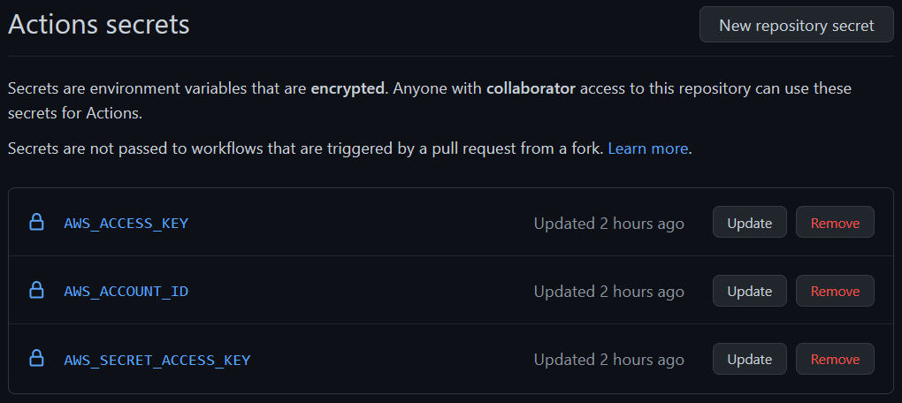
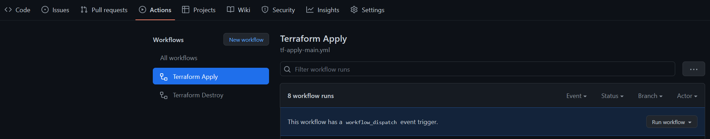
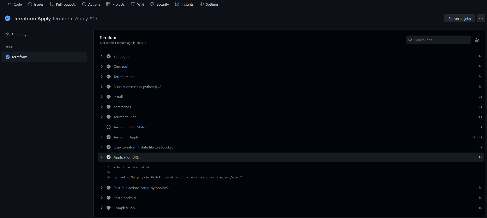
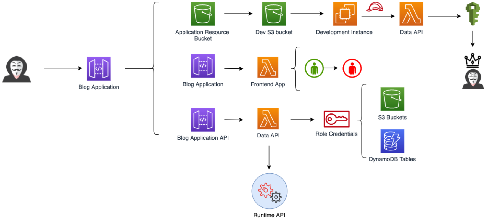
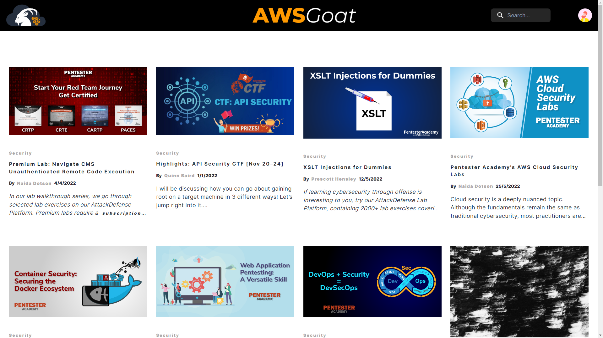
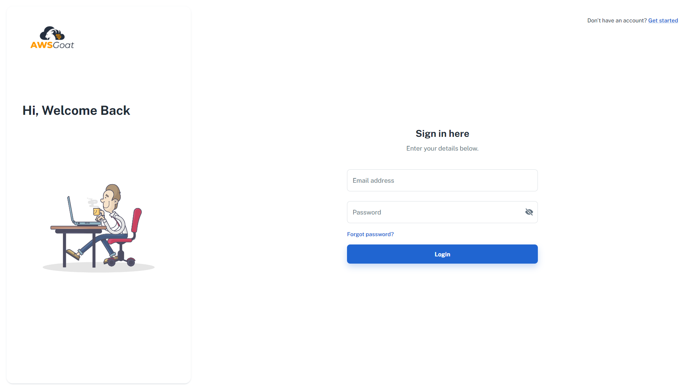
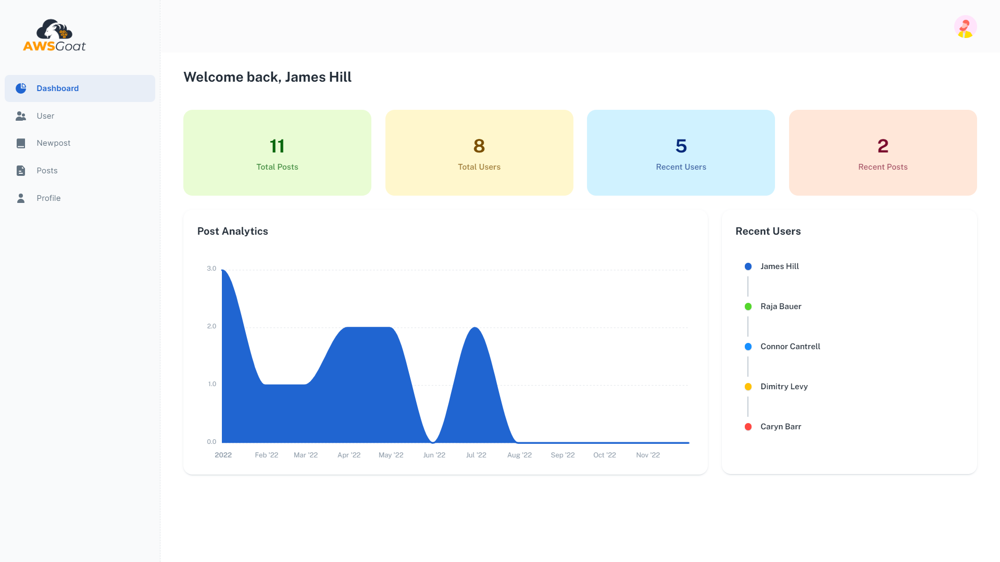
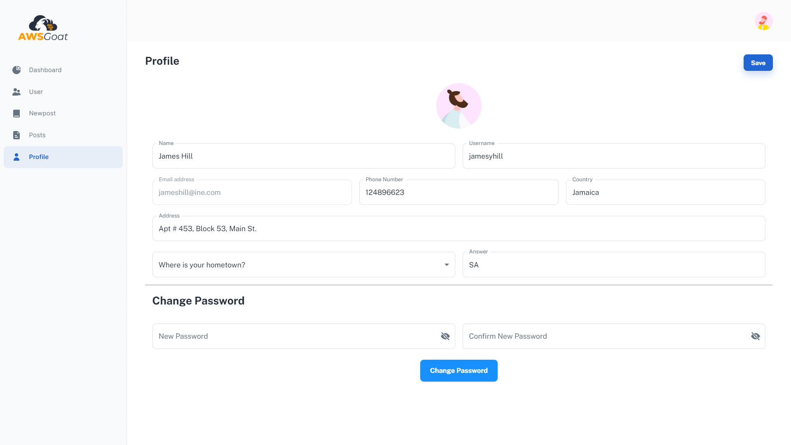

# AWS GOAT


Compromising an organization's cloud infrastructure is like sitting on a gold mine for attackers. And sometimes, a simple misconfiguration or a vulnerability in web applications, is all an attacker needs to compromise the entire infrastructure. Since the cloud is relatively new, many developers are not fully aware of the threatscape and they end up deploying a vulnerable cloud infrastructure.

AWSGoat is a vulnerable by design infrastructure on AWS featuring the latest released OWASP Top 10 web application security risks (2021) and other misconfiguration based on services such as IAM, S3, API Gateway, Lambda, EC2, and ECS. AWSGoat mimics real-world infrastructure but with added vulnerabilities. It features multiple escalation paths and is focused on a black-box approach.

The project will be divided into modules and each module will be a separate web application, powered by varied tech stacks and development practices. It will leverage IaC through terraform and GitHub actions to ease the deployment process.

## Built With

* AWS
* React
* Python 3
* Terraform

## Vulnerabilities

The project is scheduled to encompass all significant vulnerabilities including the OWASP TOP 10 2021, and popular cloud misconfigurations.
Currently, the project  contains the following vulnerabilities/misconfigurations.

* XSS
* SQL Injection
* Insecure Direct Object reference
* Server Side Request Forgery on Lambda Environment
* Sensitive Data Exposure and Password Reset
* S3 Misconfigurations
* IAM Privilege Escalations

# Getting Started

### Prerequisites
* An AWS Account
* AWS Access Key with Administrative Privileges


### Installation

To ease the deployment process the user just needs to fork this repo, add their AWS Account Credentials to GitHub secrets, and run the Terraform Apply Action. This workflow will deploy the whole infrastructure and output the hosted application's URL. 

Here are the steps to follow:

**Step 1.** Fork the repo

**Step 2.** Set the GitHub Action Secrets:

```
AWS_ACCESS_KEY
AWS_ACCOUNT_ID
AWS_SECRET_ACCESS_KEY
```



**Step 3.** From the repository actions tab, run the ``Terraform Apply`` Workflow.



**Step 4.** Find the application URL in the Terraform output section.




### Manual Installation

Manually installing AWSGoat would require you to follow these steps:

**Step 1.** Clone the repo
```sh
git clone https://github.com/ine-labs/AWSGoat
```

**Step 2.** Configure AWS User Account Credentials
```sh
aws configure
```

**Step 3.** Use terraform to deploy AWSGoat
```sh
terraform init
terraform apply --auto-approve
```

# Modules

## Module 1

The first module features a serverless blog application utilizing AWS Lambda, S3, API Gateway, and DynamoDB. It consists of various web application vulnerabilities and facilitates exploitation of misconfigured AWS resources.

Overview of escalation paths for module-1




**Recommended Browser:** Google Chrome

## Module 2

The second module is under development and would feature an internal HR Payroll application, utilizing the AWS ECS infrastructure. The module will be released after Black Hat USA 2022.

# Contributors

Jeswin Mathai, Chief Architect, Lab Platform, INE  <jmathai@ine.com>

Nishant Sharma, Director, Lab Platform, INE <nsharma@ine.com>

Sanjeev Mahunta, Software Engineer (Cloud), INE <smahunta@ine.com>

Shantanu Kale, Cloud Developer, INE  <skale@ine.com>


# Solutions

Solutions for all vulnerabilities in the application will be released shortly.

# Screenshots

Blog Application HomePage



Blog Application Login Portal



Blog Application Register Page


Blog Application Logged in Dashboard



Blog Application User Profile



## Contribution Guidelines

* Contributions in the form of code improvements, module updates, feature improvements, and any general suggestions are welcome. 
* Improvements to the functionalities of the current modules are also welcome. 
* The source code for each module can be found in ``modules/module-<Number>/src`` this can be used to modify the existing application code.

# License

This program is free software: you can redistribute it and/or modify it under the terms of the MIT License.
