# Objectives

Perform SQL Injection and log into the web application 

# Solution

* Go to the login page of the web application.

* Now, we can find **Email** as an injection point to perform the SQLi.

    

*  Let's try the most commonly used command in SQLi attacks, i.e. :
    ```sql
    ' OR 'x'='x
    ```

* Use the above payload in the **Email** and **Password** fields

    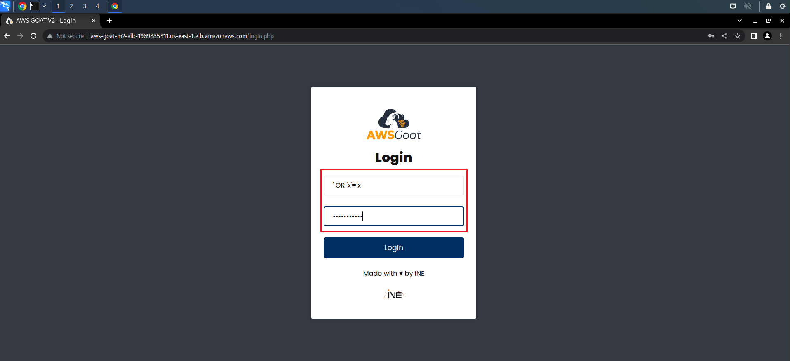

* Here, we are passing an OR statement and passing a condition, x=x which will always be true. Hence we will be able to dump all the rows from the queried table. To pass our input as a SQL command rather than a simple string, we are using a single quote. Single quotes in SQL are generally used to indicate beginning and end of strings in input fields. So by adding a single quote (') we are past the email input parameter and can add SQL code after that.

    


* As we can see, there is a front-end check for the **Email** field. To get around that, we need to change the input field's type from **email** to **text** and then perform the injection. This should work if there is no backend email verification.

    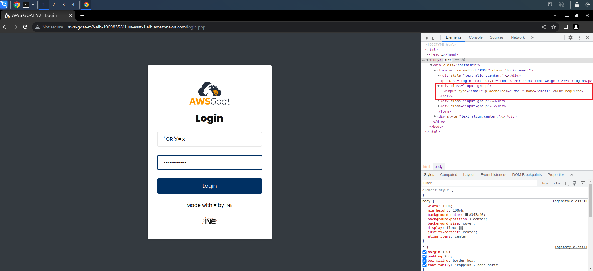

    

* After changing the field type, submit the login form by clicking on **Login** button.

    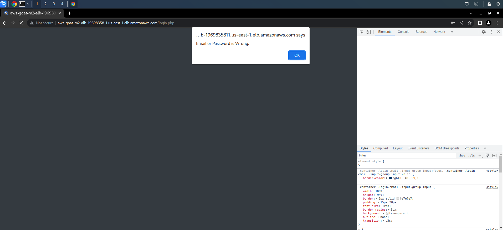

* This Payload fails, let's try another payload
    ```sql
    ' or '1'='1'#
    ```

* Use the above payload in the **Email** field. We can again use anything in the **Password** field since it will eventually get commented out.

    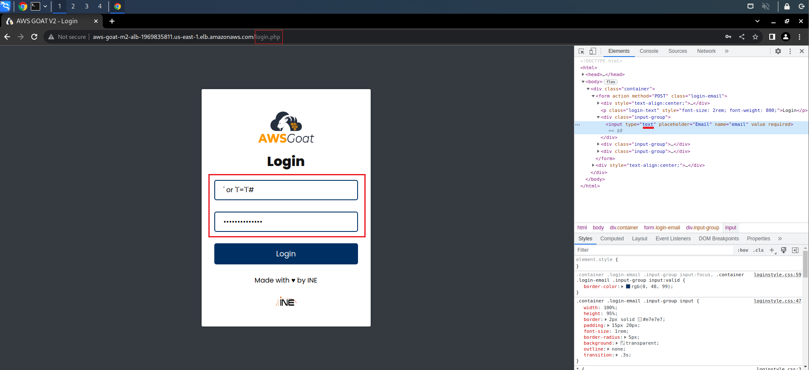

* **Voila! we are into the application!**

    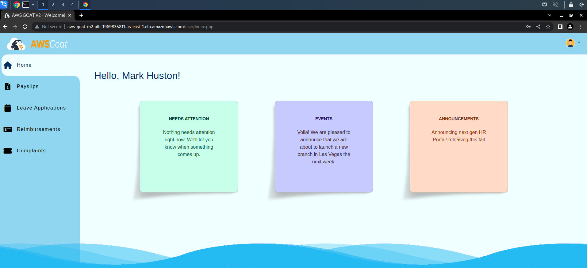

* On exploring the application we can find a file upload field for user Mark, we will revisit this later.

    

# What's happening?

* Since, this is a **PHP** application we are assuming that the backend SQL query might be something like this:
    ```php
    select * from [TABLE_NAME] where email = '$[EMAIL_INPUT]' and password = '$[PASSWORD_INPUT]';
    ```
* Now, when we use our payload the query will be converted into this:
    ```php
    select * from [TABLE_NAME] where email = '' or '1'='1'#' and password = '$[PASSWORD_INPUT]'; 
    ```
* If we look at the above code snippet, our payload  `'or '1'='1' #`  is replaced in the `$[EMAIL_INPUT]`, and the password field is commented out. Hence, we can get all the rows from the table where users are stored! 

* Now let's explore this page.

# Further Modifications

* This seems to be a **Normal User** login. Let's see if we can log in to a different user by making modifications to the payload.

* Since everything after the "**#**" gets commented out, we can add some **SQL** conditions before the "**#**" in the payload to modify the output! 

* When dumping all the table rows the SQL LIMIT clause can be helpful to control the number of rows returned by SQL. Let's use the payload below: 

    ```sql
    'or '1'='1' LIMIT 5 #
    ```

    

* This worked but logged us back in to the same user. Let's try changing the `LIMIT 5` to `LIMIT 4`

* We can now see that the username has indeed changed, but this one too looks like a normal user.

    

* Let's try changing the `LIMIT 4` to `LIMIT 3`.
    
    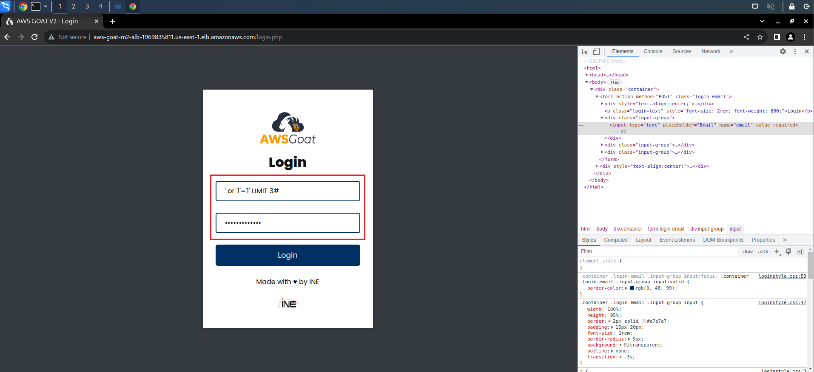

* Now we can see that this is another account and if we carefully examine this doesn't seem like a normal user. This is a managers' account!
    
    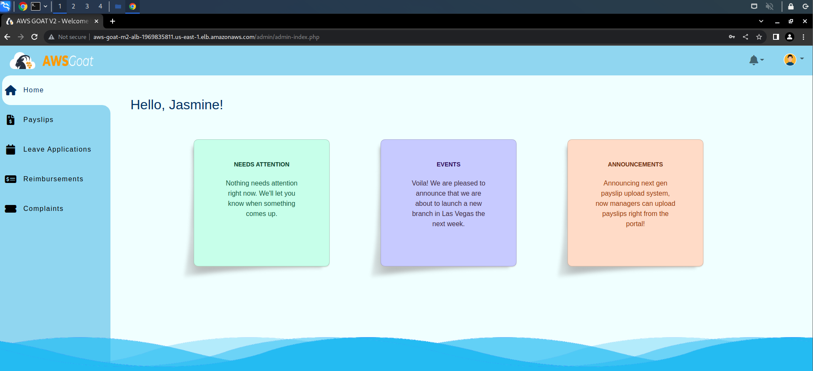

    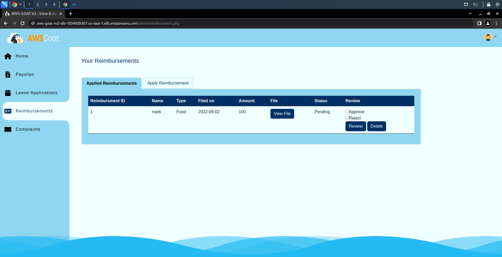

* And this user has a different file upload field, to upload payslips.

    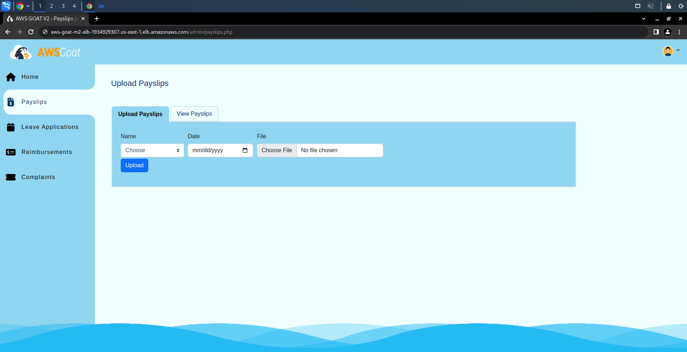

* Let's now try using another SQL clause ORDER BY, used to sort the query output in the payload:

    ```sql
    'or '1'='1' ORDER BY id#
    ```

* Here in the above payload, we are assuming that the DBMS table consists of a column named `id`, let's check if it can fetch anything useful.

    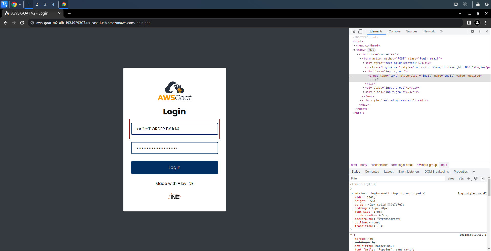


* We are logged back into the same normal user. By this point we can guess the structure of the table where this user data is stored. The id field will let us access the users with the highest and lowest id using the `ORDER BY` clause.

    | id | email | password |
    | -- | --- | ----------- |
    | 1 | user1 | password1 |
    | 2 | user2 | password2 |

* Let's try adding `DESC` and see if anything different comes up.

    

* Here if you examine, you can see we logged into a different user and this time it's neither a normal user nor a manager but it's the admin!
    
    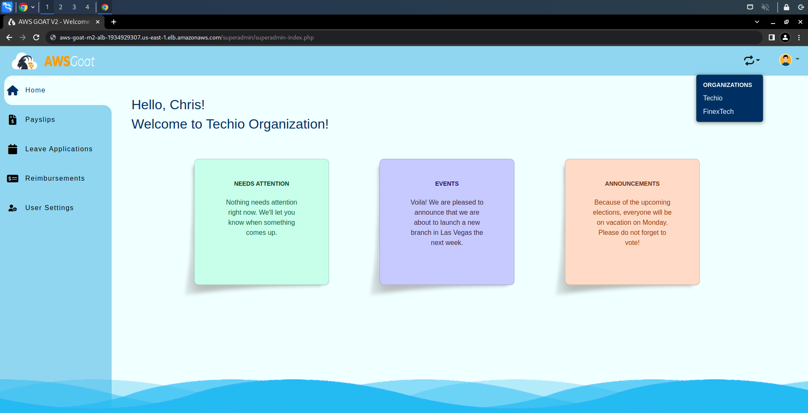

* Explore further to find the functionalities of the respective user types.

# Key Findings

* The **Email** field is injectable.

* This is a **PHP** based web application.

* We can use `'or '1'='1'#` payload to login into the web application.

* There exists an ``id`` field along with the email and password in the database table.

* We can further modify the payload to add additional constraints and log into the web application using different users!

* There seem to be 3 types of users:
    * Normal User
    * Manager
    * Admin

* There are 4 ways a user can upload a file:
    * Normal user > Reimbursements page.
    * Manager > Payslips page & Reimbursements page.
    * Admin > Payslips page.