# Objective

Use AWS IAM Access Analyzer to identify resources shared with an external entity and unintended access to your resources and data, which may pose a security risk.

# Solution

Log in to [AWS account](https://aws.amazon.com/) where [AWS Goat](https://github.com/ine-labs/AWSGoat) infrastructure has been deployed.

Search for "IAM" and navigate to the IAM dashboard.

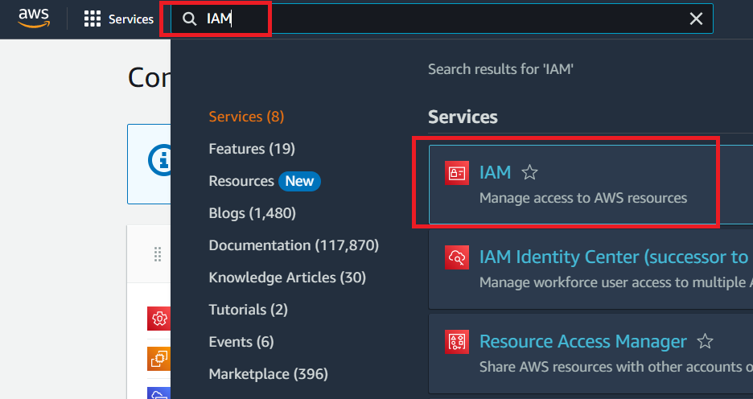

Click on "Access analyzer" from the access reports.

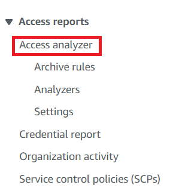

Access Analyzer helps you identify the resources in your organization and accounts, such as Amazon S3 buckets or IAM roles, shared with an external entity. This lets you identify unintended access to your resources and data, which is a security risk.

Now, Click on "Create analyzer".

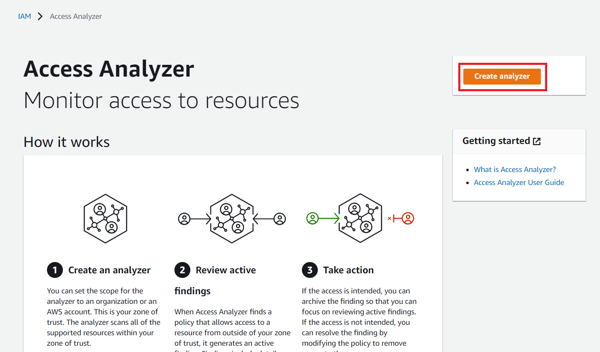

Set everything as default and click on "Create analyzer".

Access Analyzer generates a finding for each instance of a resource shared outside of your account. The findings include details about the access and the external principal who granted it. When you create an analyzer, you choose an organization or AWS account to analyze. Any principal in the organization or account that you choose for the analyzer is considered trusted.

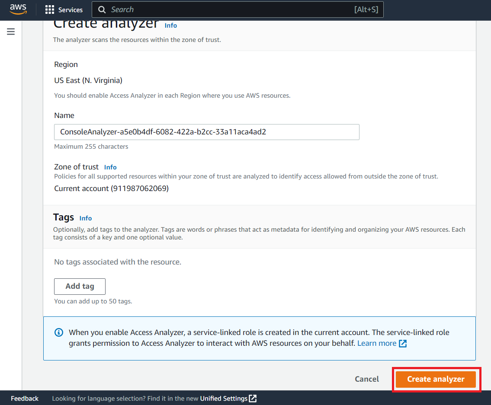

Access Analyzer generates a finding for each instance of a resource-based policy that grants access to a resource within your zone of trust to a principal that is not within your zone of trust. Any sharing that is within the zone of trust is considered safe, so Access Analyzer does not generate a finding.

Click on "Finding ID" of the resource "S3 Bucket". This will list details about the finding.

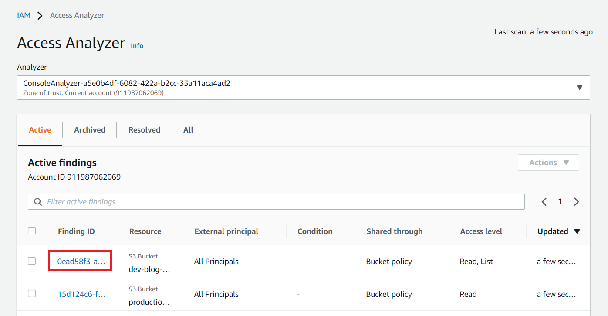

This finding shows that the resource (S3 Bucket) is open to the public and "Read" and "List" operations can be performed on it.

Here, Access level "List" is the unintended access to this S3 Bucket and this may lead to the sensitive data exposure. The "s3:ListBucket" permission returns a list of all buckets owned by the authenticated sender of the request and we don't want our user to have this permission. Whereas, "s3:GetObject" permission is simply used to retrieves objects from Amazon S3 bucket. And we need "s3:GetObject" permission to run our web application.

Click on the resource ARN to navigate to the resource (Open it in a separate tab).

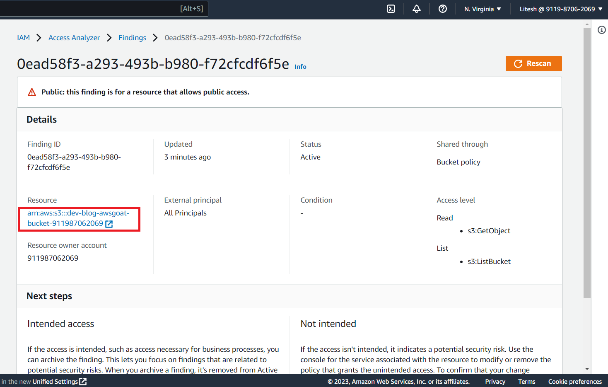

Click on "Permissions" 

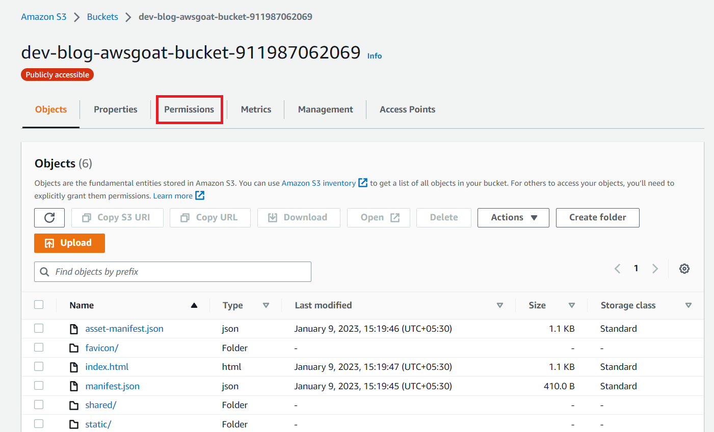

Here, click on "Edit" and remove the "s3:ListBucket" action.

Remove the "s3:ListBucket".

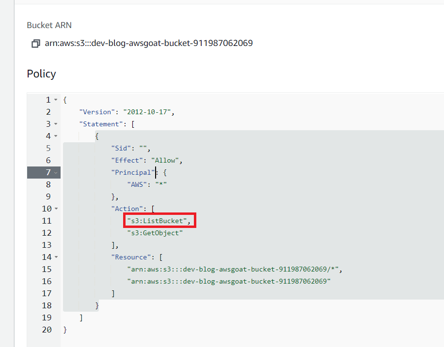

Now, click on the "Save changes".

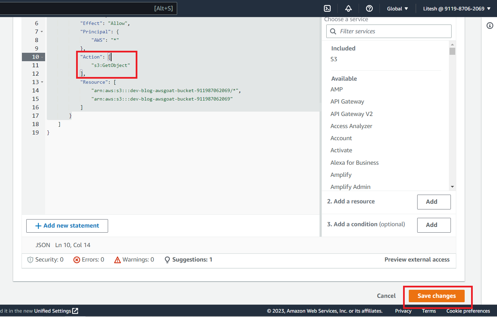

We can see the permission got removed.

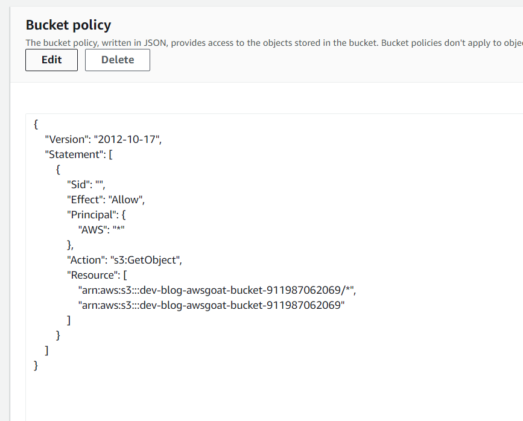

Click on "Rescan" and you will see the "Status" got changed to "Resolved".

If the resource is no longer shared outside of your zone of trust, the status of the finding is changed to Resolved. The finding is no longer displayed in the Active findings table, and instead is displayed in the Resolved findings table. Now, the access is removed, the status changed to Resolved.

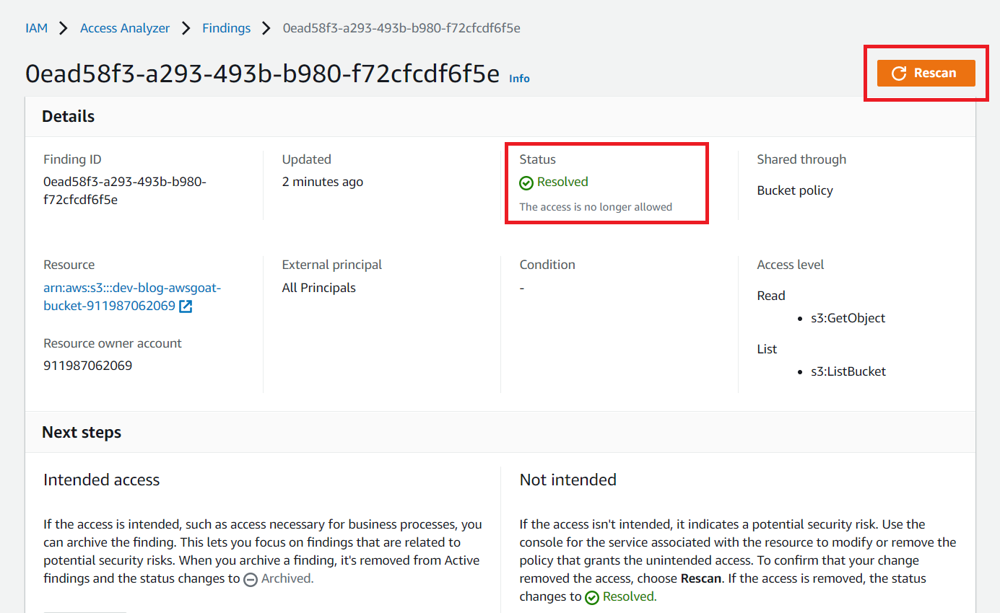

Now, navigate back to the findings dashboard and click on the another finding ID.

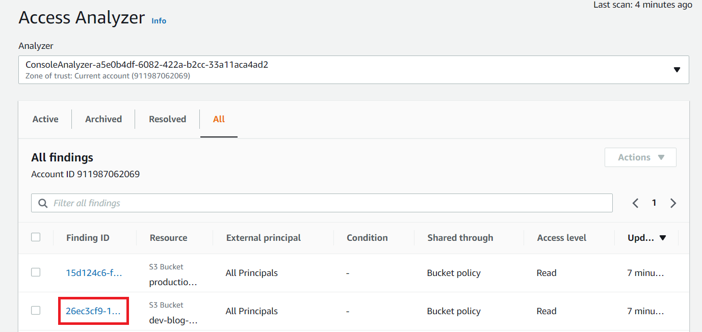

This finding is due to the bucket being open to the public, as we intended. So, let us "Archive" this finding by clicking on the "Archive" button.

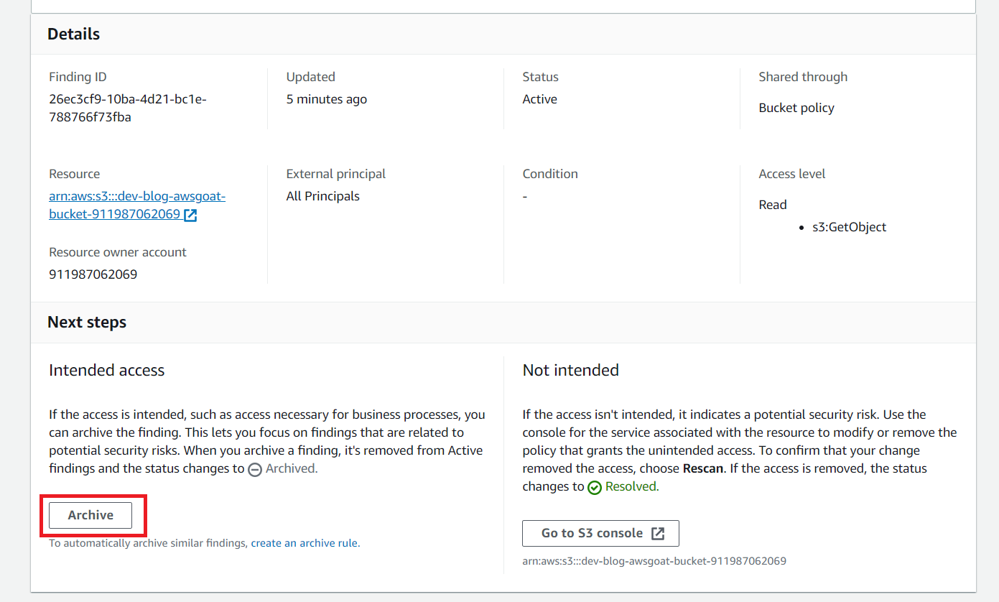

Again, navigate back to the findings dashboard and click on the next finding ID.

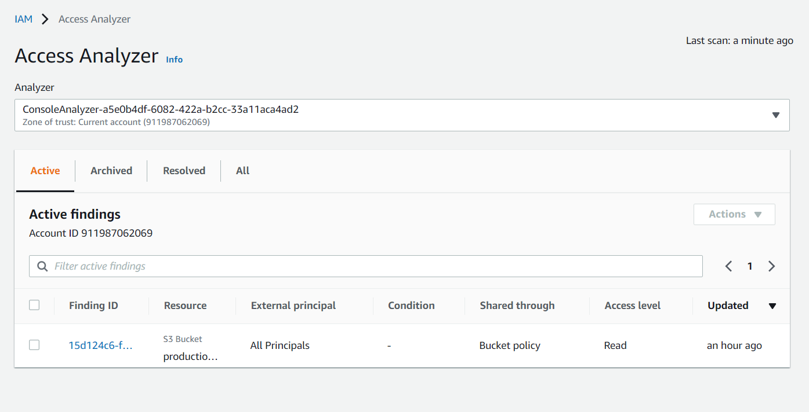

Same as before, this finding is due to the bucket being open to the public, as we intended. So, let us "Archive" this finding as well by clicking on the "Archive" button.

You can click on the resource ARN to view the resource details.

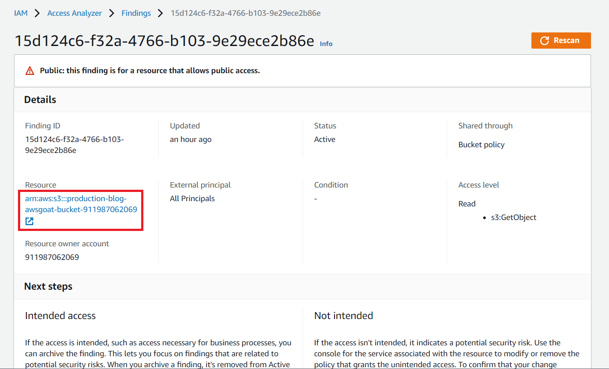

Click on the "Archive" button to archive the finding.

When you archive a finding, it is removed from Active findings and the status changes to Archived.

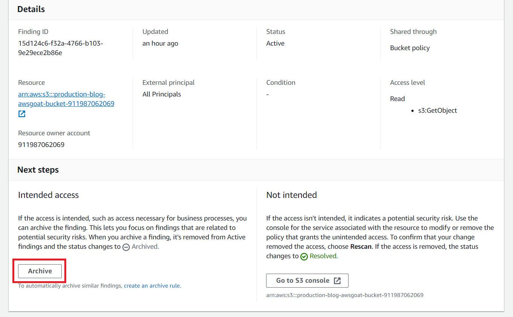

Navigate back to the findings dashboard. Since, we resolved and archived all the findings no more findings are listed here to resolve.

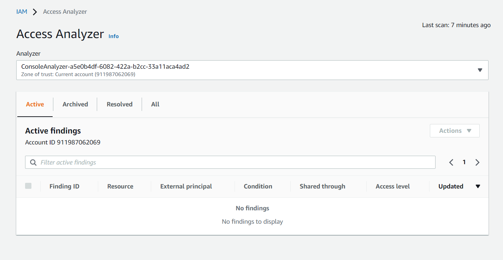

# Inferences

* Access Analyzer identifies the resources, shared with an external entity which may pose security threat.

* Access Analyzer generates a finding for each instance of a resource shared outside of your account. The findings include details about the access and the external principal who granted it.

* Using the findings we can take the necessary actions.

* This can defend us against the attack performed in [IAM Privilege Escalation](https://github.com/ine-labs/AWSGoat/blob/master/attack-manuals/module-1/07-IAM%20Privilege%20Escalation.md) when the attacker tries to list the bucket objects. 

# Further Readings

* [What is IAM Access Analyzer](https://docs.aws.amazon.com/IAM/latest/UserGuide/what-is-access-analyzer.html)

* [IAM Security Best Practices](https://docs.aws.amazon.com/IAM/latest/UserGuide/best-practices.html)