# Objective

Use Amazon GuardDuty findings to analyze S3 data events from your S3 buckets and monitor them for malicious and suspicious activity.

# Solution

Log in to [AWS account](https://aws.amazon.com/) where [AWS Goat](https://github.com/ine-labs/AWSGoat) infrastructure has been deployed.

Search for "GuardDuty" and navigate to the GuardDuty dashboard.

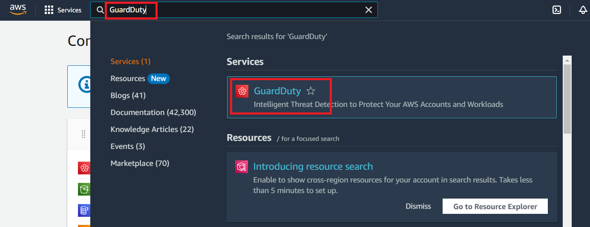

Amazon GuardDuty is a threat detection service that continuously monitors your AWS Service accounts, workloads, and data stored in Amazon S3 for malicious activity and provides detailed security findings for visibility and remediation.

Click on "Get Started".

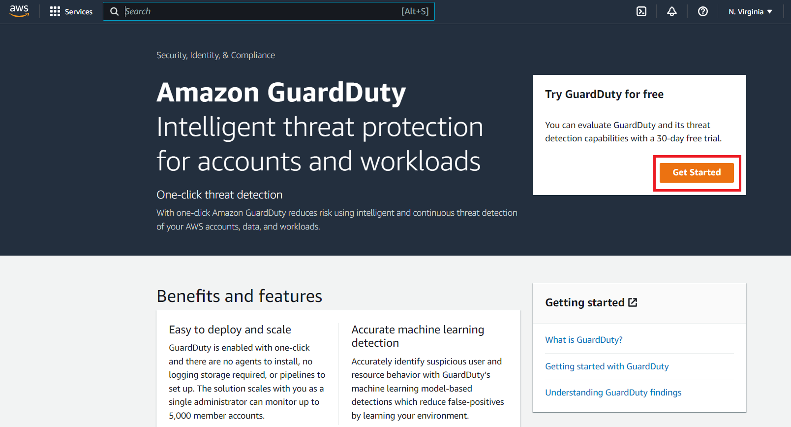

Click on "Enable GuardDuty".

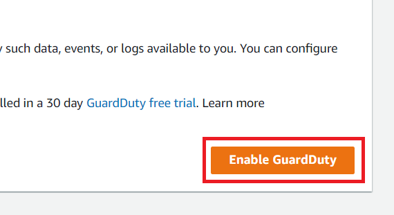

A GuardDuty finding denotes a potential security issue discovered in your network. When GuardDuty detects unexpected and potentially malicious activity in your AWS environment, it generates a finding. You can view and manage your GuardDuty findings via the Findings page in the GuardDuty console, as well as through AWS CLI or API operations.

Since GuardDuty takes time to generate the findings, there may not be any findings available initially. The findings will eventually appear after some time. Keep pressing the refresh button.

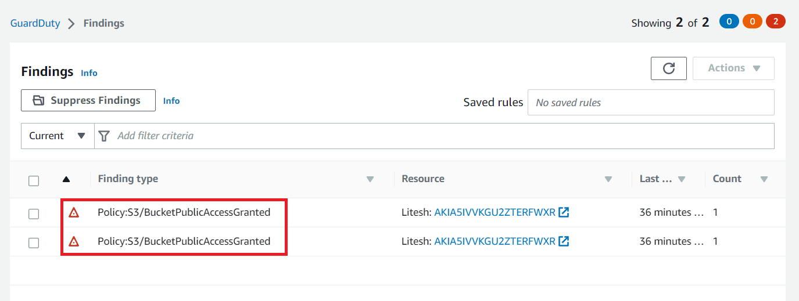

Once the finding appears, click on the finding to get a detailed view. This will provide the details about the affected resources.

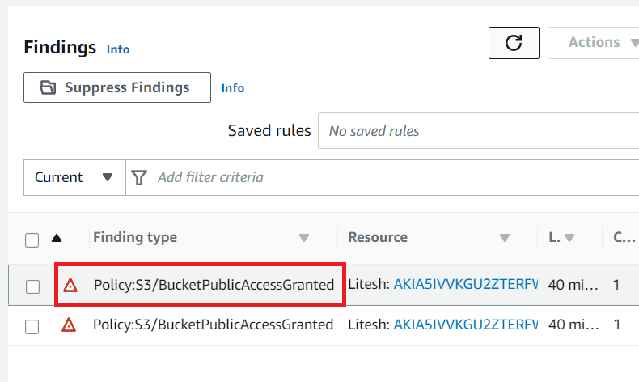

Each GuardDuty finding has an assigned severity level and value that reflects the potential risk. GuardDuty breaks down this range into High, Medium, and Low severity levels. This bucket is having "High" severity level.

The finding will provide the details about the affected resource. It will also provide the action done. Here the action was to change bucket Policy and it is listed as "PutBucketPolicy".

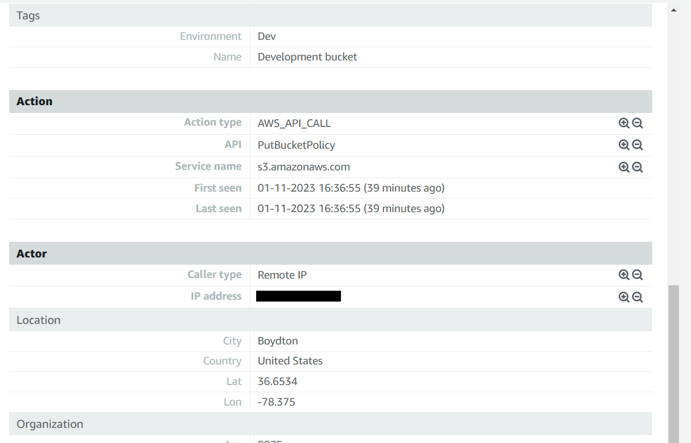

The finding also informs you that the listed S3 bucket has been publicly exposed to all the authenticated AWS users because an IAM entity has changed a bucket policy on that S3 bucket.

To take the necessary action on the resource (S3 bucket), click on the "Resource ID" and it will navigate you to the resource. 

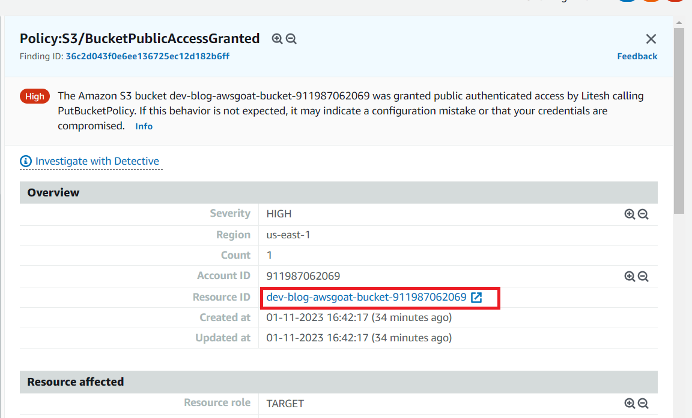

Here we want to check the bucket permissions so, click on the "Permissions" tab.

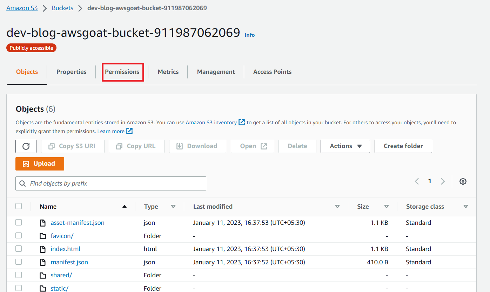

Here, "s3:ListBucket" permission is the unintended access to this S3 Bucket and this may lead to the sensitive data exposure. The "s3:ListBucket" permission returns a list of all buckets owned by the authenticated sender of the request and we don't want our user to have this permission. Whereas, "s3:GetObject" permission is simply used to retrieves objects from Amazon S3 bucket. And we need "s3:GetObject" permission to run our web application.

To edit the bucket permissions, click on the "Edit" button.

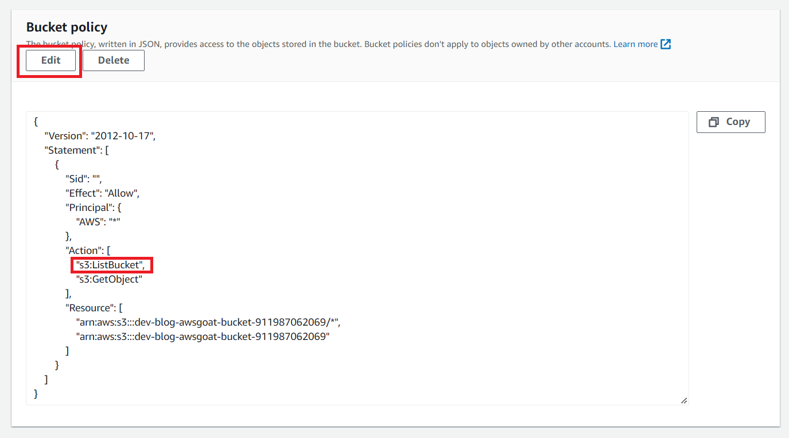

Here remove the "s3:ListBucket" permission using editor and click on the "Save changes" button.

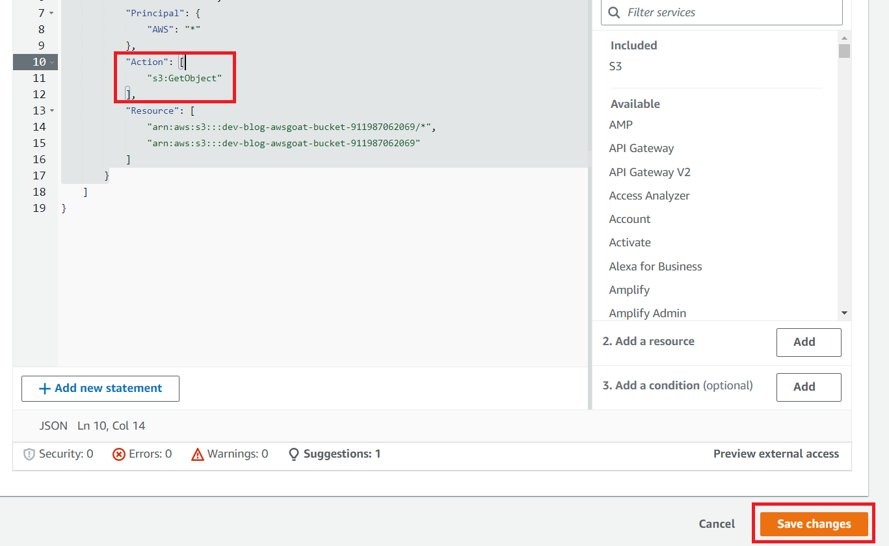

You can see the Bucket policy got changed.

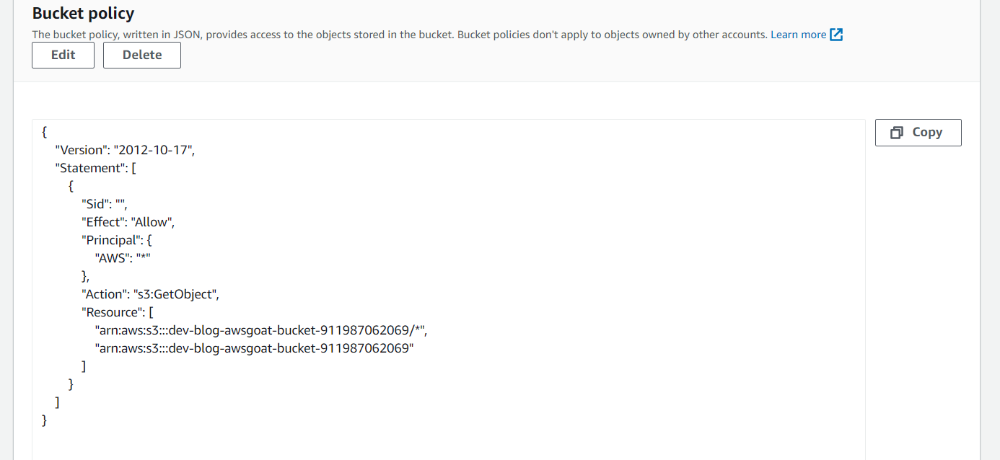

Now, navigate back to the GuardDuty dashboard and click on the another finding available.

You will notice that this finding is identical to the one discussed above, just the bucket name is different.

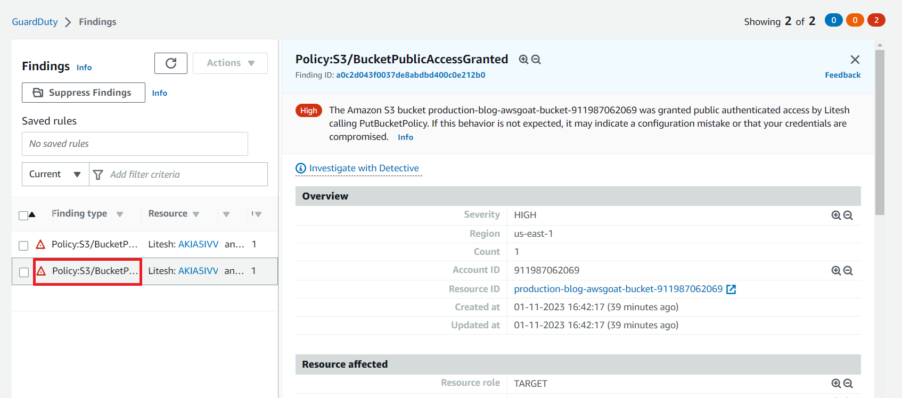

To check the bucket policy click on the "Resource Id" and it will navigate you to the resource.

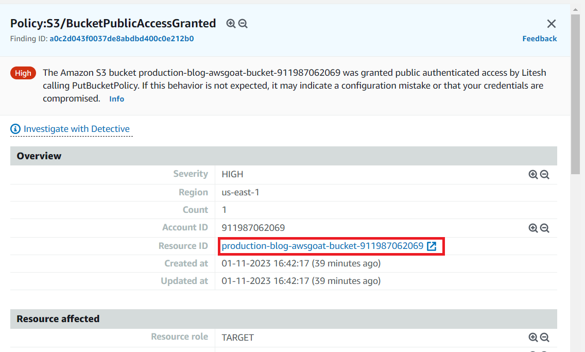

Here, click on the "Permissions" tab.

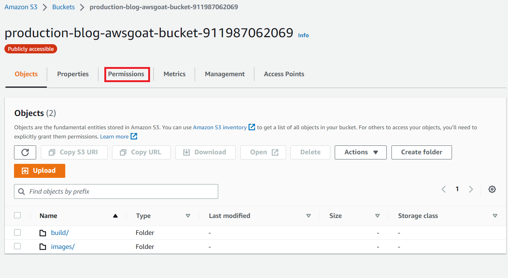

The bucket policy looks exactly what we wanted. So, we will not take any action or change anything here.

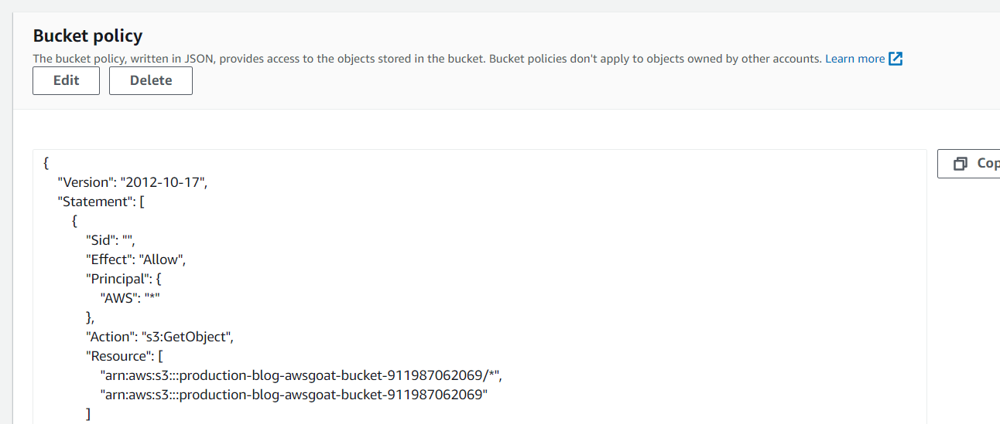

Thus, GuardDuty generates the findings whenever it detects unexpected and potentially malicious activity in your AWS environment and allows us to take the necessary actions.

# Inferences

* GuardDuty is a threat detection service that continuously monitors your AWS Service accounts, workloads, and data stored in Amazon S3 for malicious activity.

* When GuardDuty detects unexpected and potentially malicious activity in your AWS environment, it generates a finding.

* Using the findings we can take the necessary actions.

* This can defend us against the attack performed in [IAM Privilege Escalation](https://github.com/ine-labs/AWSGoat/blob/master/attack-manuals/module-1/07-IAM%20Privilege%20Escalation.md) when the attacker tries to list the bucket objects. 

# Further Readings

* [What is AWS GuardDuty](https://docs.aws.amazon.com/guardduty/latest/ug/what-is-guardduty.html)

* [IAM Security Best Practices](https://docs.aws.amazon.com/IAM/latest/UserGuide/best-practices.html)