# Objective

Find vulnerable objects in AWS S3 bucket using Amazon Macie.

# Solution

* Log in to [AWS account](https://aws.amazon.com/) where [AWS Goat Module:1](https://github.com/ine-labs/AWSGoat) infrastructure has been deployed

*  Now, search for **Amazon Macie** and head to it's page.

    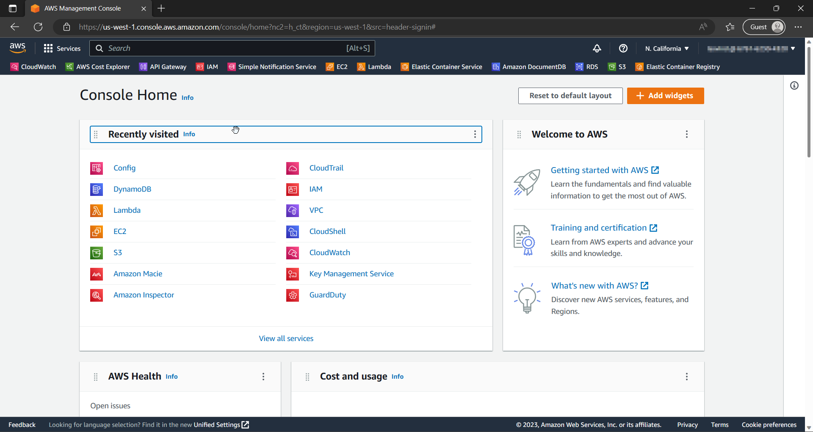

    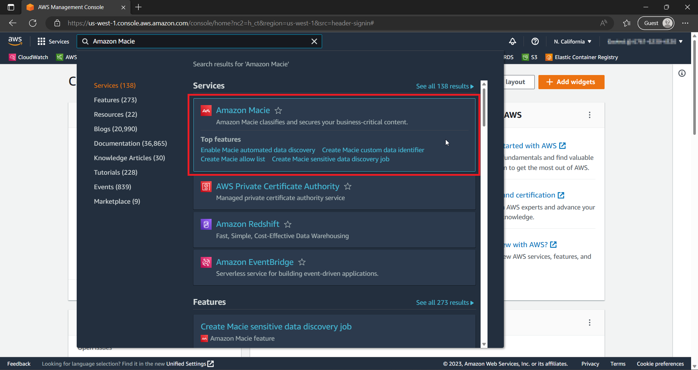

* Click on **Get Started** and in the next page click on **Enable Macie**. 

    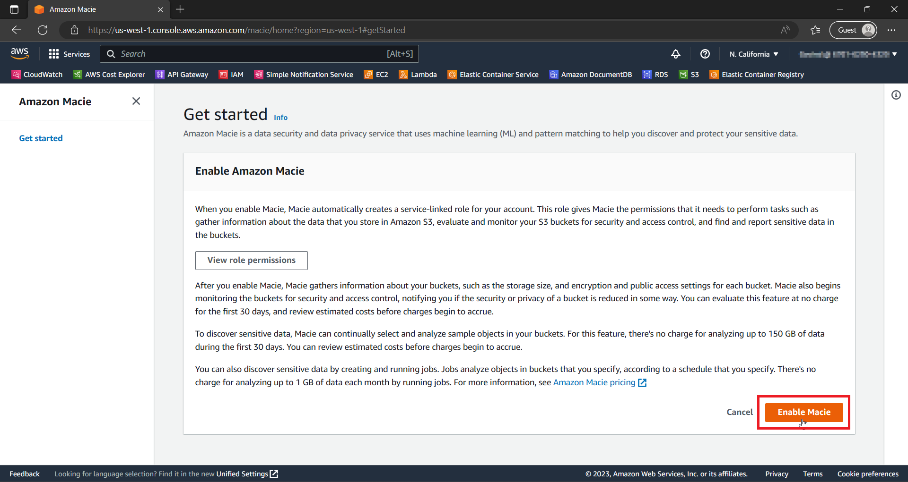


## Finding Vulnerable objects in public S3 Bucket


* Now, in the **Get Started** section, click on **Create job** under **Analyze public buckets**

    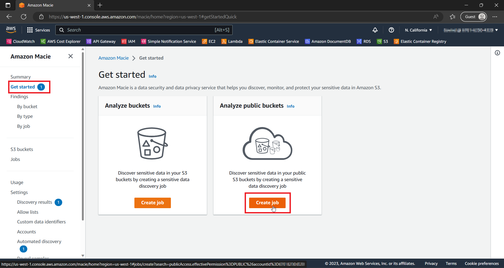

* Select the following buckets which are public and click on **Next**.
    
    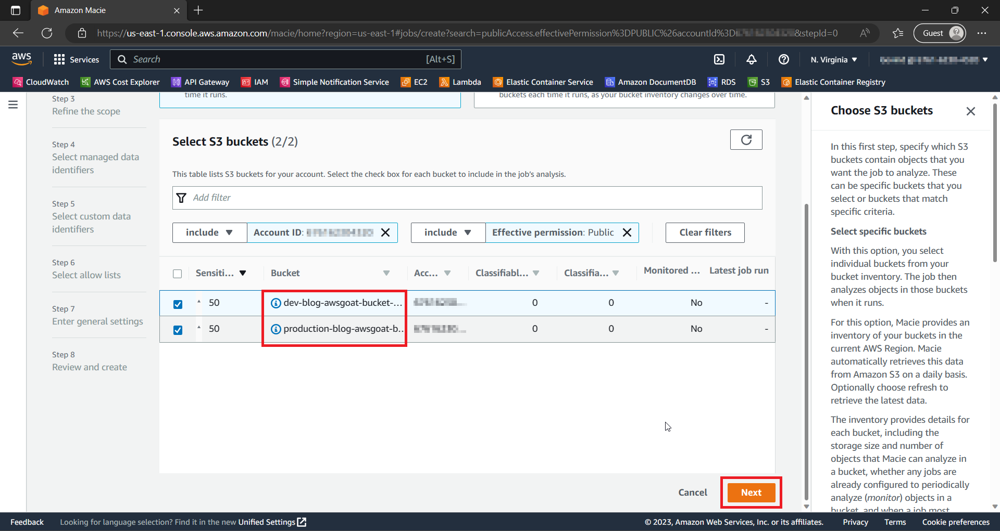

* In **Refine the scope** step, select **One-time job** for **Sensitive data discovery options** and click on **Next**.

    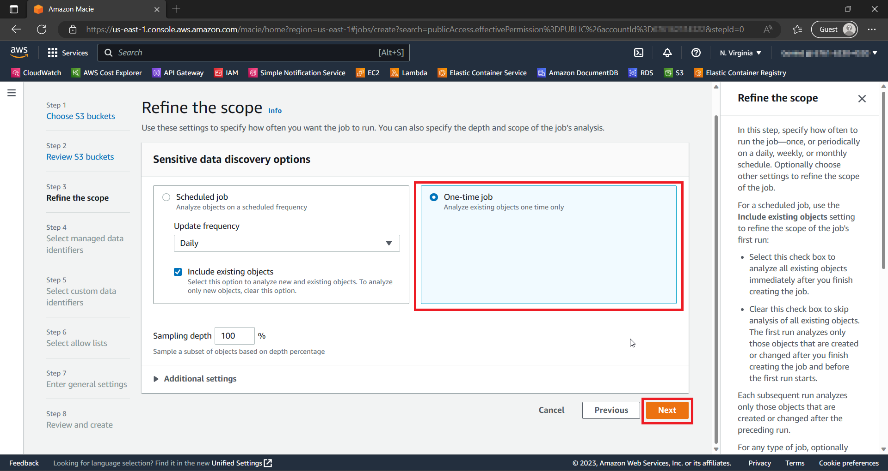

* In **Select managed data identifiers**, choose **Include** option and select all the data types with **CREDENTIALS** as **Sensitive data catagory** and click on next.
    
    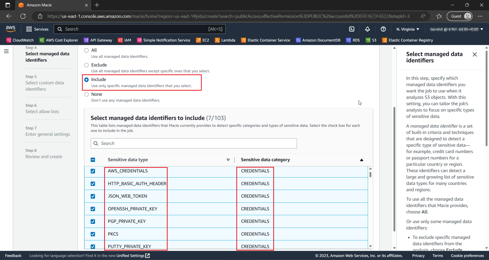

* Click on **Next** in all the other screens and click on **Submit**.

    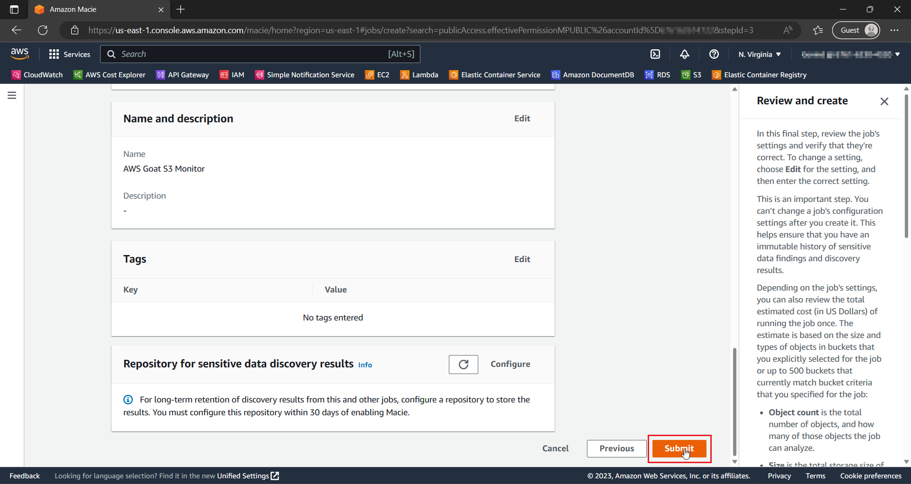

* Now, wait for 7 to 12 minutes while Macie scans for vulnerable objects.

* After the run has completed, click on **Show Results** to find out which object is vulnerable.

    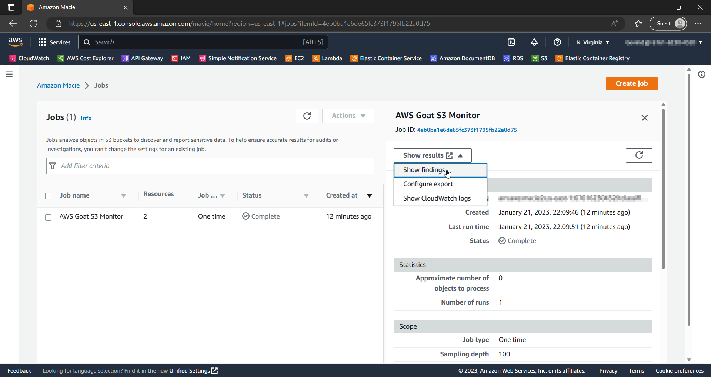

* Now, we can see that **.pem** files have public read access which is unneccesary and might give access to one of our ec2 instances.

    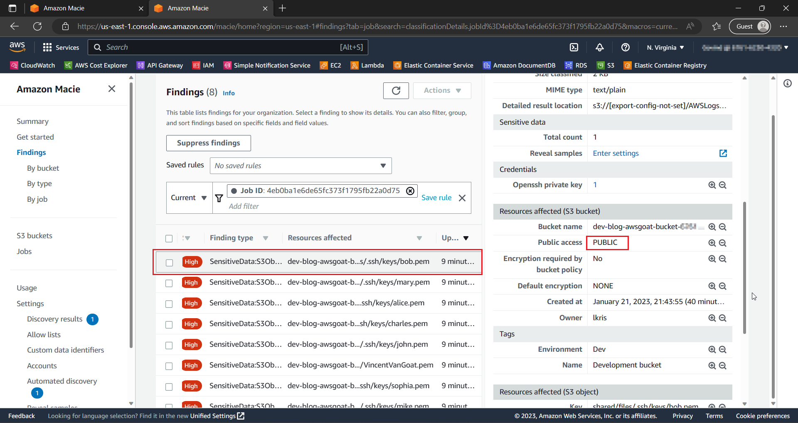

## Fixing misconfigured permissions

* Go to the application's home page, and click on **View page source** from the *right-click* menu.

    

* Now, click on the link displayed on page.

    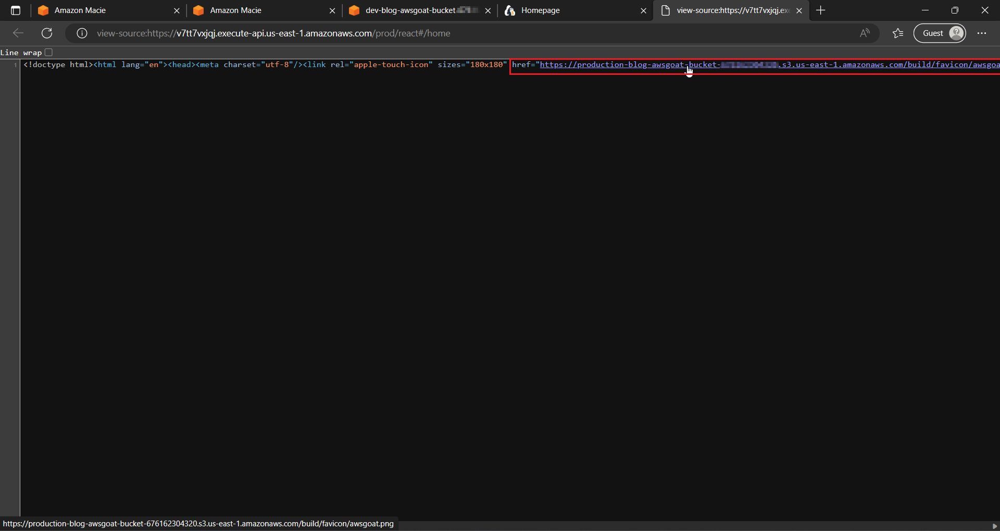

* if we observe carefully, the vulnerable objects are present in dev bucket. Hence, replace **production** with **dev** and add the payload after url. Let's check if we can access the .pem file.

    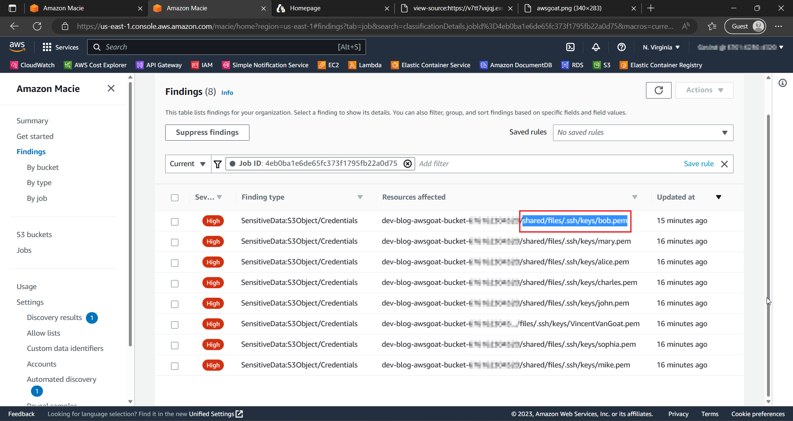

    

* Your address would be similar to this:
    ```html
    https://dev-[bucket-url]/shared/files/.ssh/keys/bob.pem
    ```

* We can see that the **bob.pem** file has been downloaded. Which means anyone on the internet can access it and can get access to ec2 instance.

* Now, let's remove the public read access in the permissions tab of this file.

    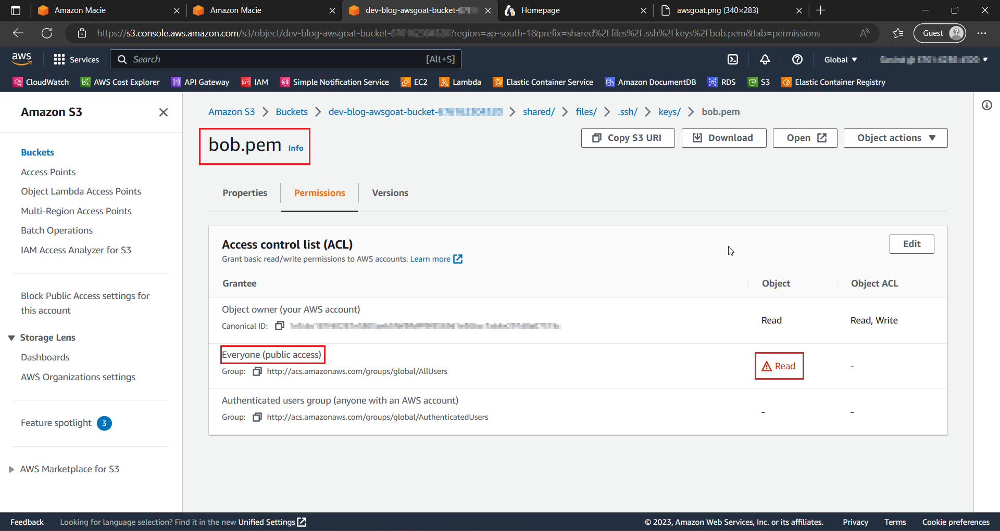

* Click on **Edit** and remove the **Public Read Access** permission. let's check if we can still download the file.

    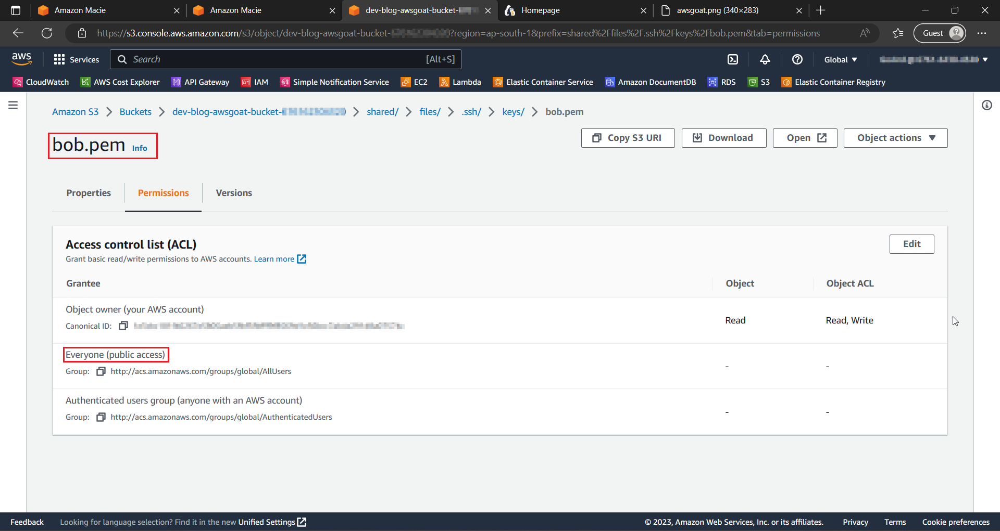
    
* We can still download the file even after removing **Public Read access**, this might be due to misconfigured bucket permissions. Let's fix them.

* Now, head to **bucket permissions**. We can see that the bucket has excessive permissions.

    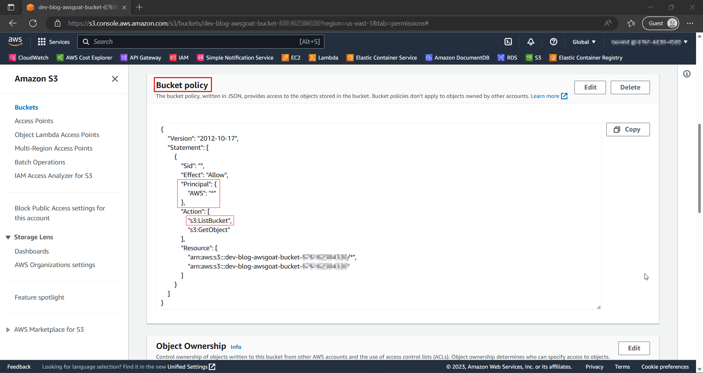

* S3 bucket should only be accessible by the resources which need it. Now, go to IAM roles and search for **AWS_GOAT_ROLE**. Copy the role's *ARN*.

    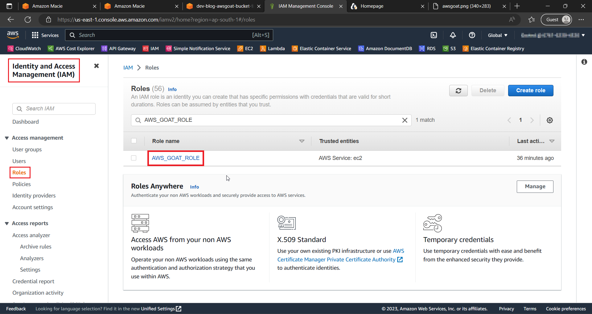

    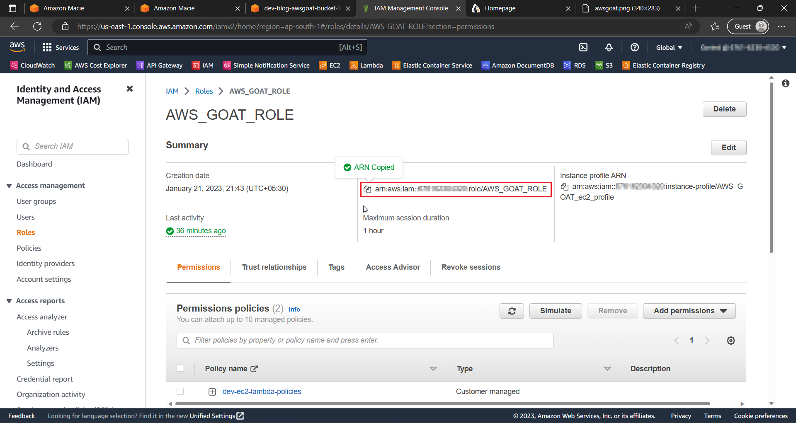

* Go back to S3 bucket's permissions tab. and add the copied ARN to the **principal** and also remove **ListBucket** permission. Your policy statement should look like this:

    ```json
    {
        "Version": "2012-10-17",
        "Statement": [
            {
                "Sid": "",
                "Effect": "Allow",
                "Principal": {
                    "AWS": "arn:aws:iam::[ACCOUNT-ID]:role/AWS_GOAT_ROLE"
                },
                "Action": "s3:GetObject",
                "Resource": [
                    "arn:aws:s3:::dev-blog-awsgoat-bucket-[ACCOUNT-ID]/*",
                    "arn:aws:s3:::dev-blog-awsgoat-bucket-[ACCOUNT-ID]"
                ]
            }
        ]
    }
    ```

    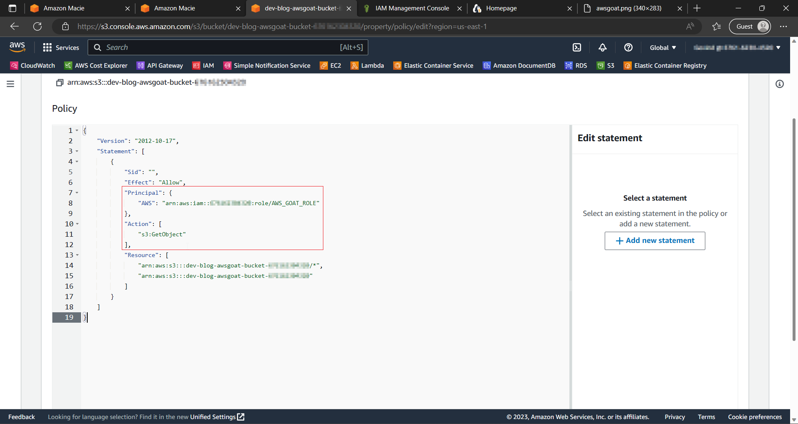

* Now, let's try to download the pem file. We can see that the access is denied!

    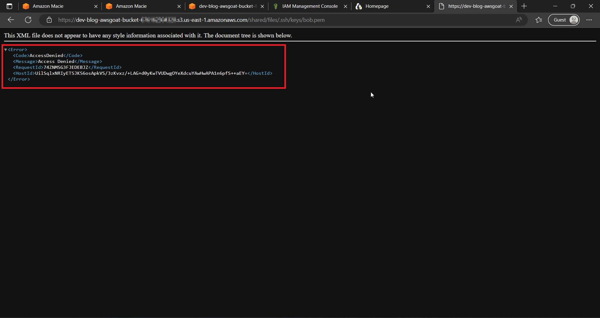

* Don't forget to remove **Public Read Access** to all the other vulnerable files.

* Voila, we can now say that we have succesfully secured our s3 bucket as well as the infrastructure.

# Inferences

* Amazon Macie helps identify vulnerable objects such as Credentials, Sensitive information etc., in our s3 buckets.

* Even though our bucket has correct permissions, we need to make sure that the objects in the bucket do not have **Public Read Access**.

* We can run **Amazon Macie** jobs weekly/monthly to detect vulnerable objects which are exploitable. This is suited for those whose infrastructure changes constantly.

* This can defend us against the attack performed in [IAM Privilege Escalation Manual](https://github.com/ine-labs/AWSGoat/blob/master/attack-manuals/module-1/07-IAM%20Privilege%20Escalation.md). where the hacker tries to download the .pem file and gets into EC2 Instance.


# Further Readings

* [What is Amazon Macie?](https://docs.aws.amazon.com/macie/latest/user/what-is-macie.html)

* [Top 10 security best practices for securing data in Amazon S3](https://aws.amazon.com/blogs/security/top-10-security-best-practices-for-securing-data-in-amazon-s3)

* [What is AWS Config?](https://docs.aws.amazon.com/config/latest/developerguide/WhatIsConfig.html)

* [IAM Security Best Practices](https://docs.aws.amazon.com/IAM/latest/UserGuide/best-practices.html)